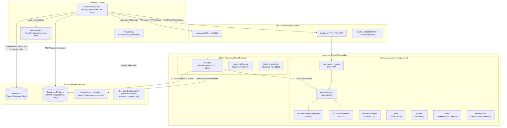
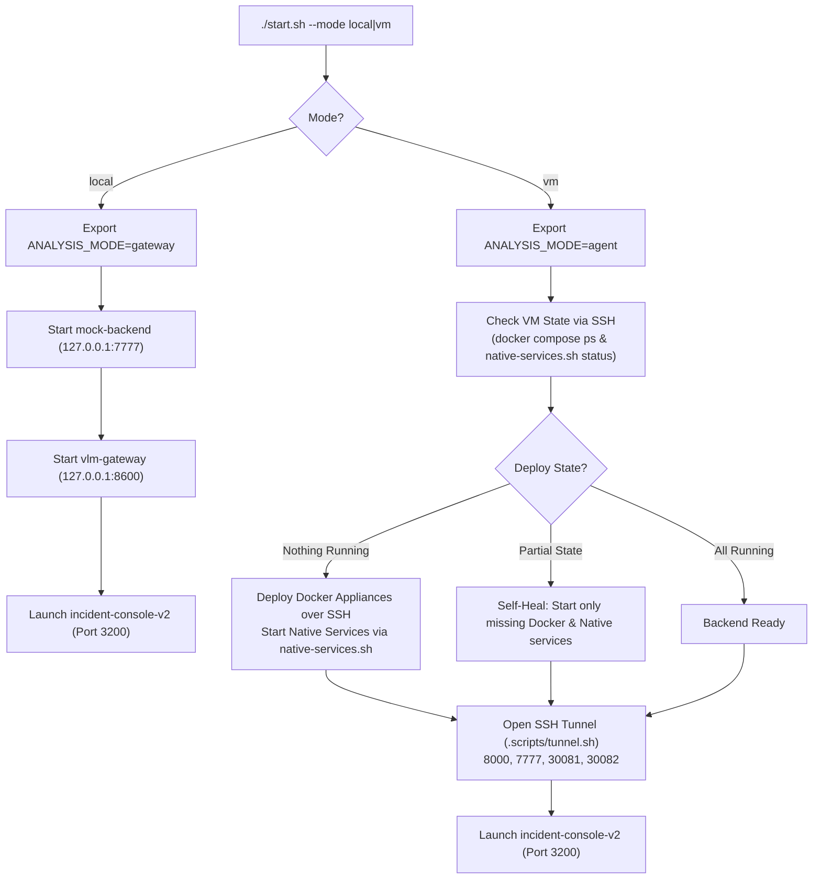
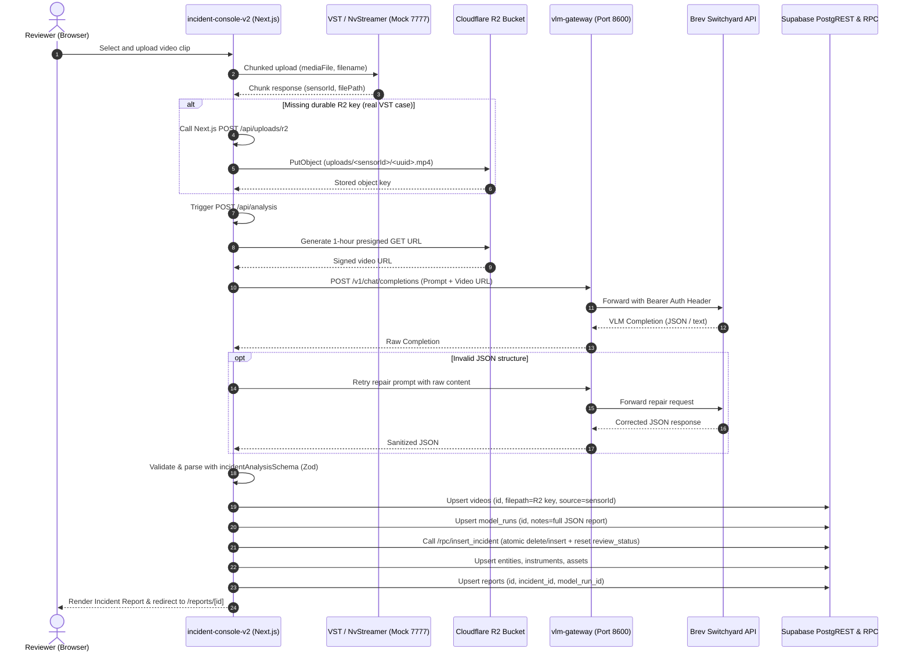
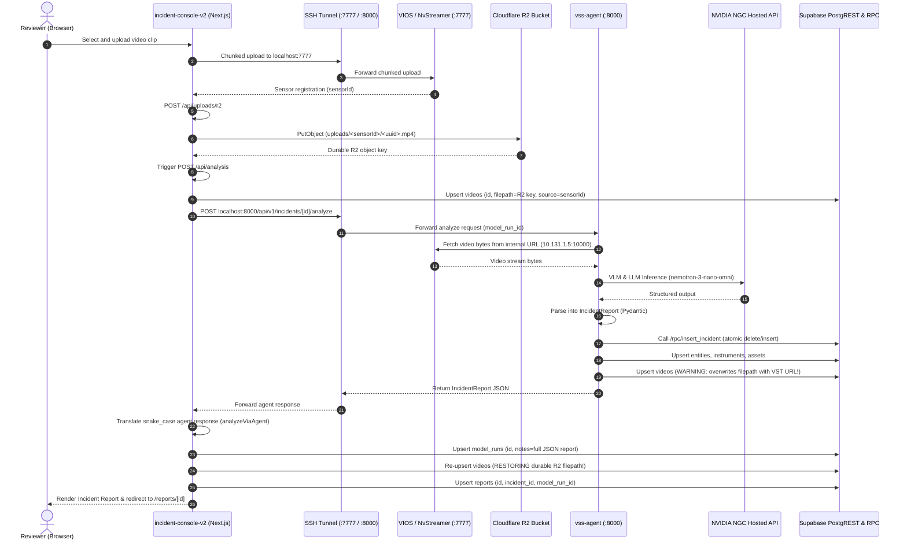
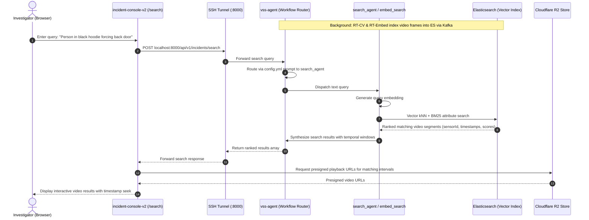

# Incident Search & Reporting Capstone — Architecture

This document describes the system architecture, component topology, deployment mechanics, and
runtime interaction sequences for `dev-profile-incident`.

---

## 1. System Context Architecture

The system spans three runtime tiers:
1. **Developer Laptop:** Hosts the modern frontend (`incident-console-v2`), local API proxies (`vlm-gateway`),
   and base mocks (`mock-backend`).
2. **Shared GPU Workstation (`kwanz-ws` VM):** Runs the heavy video ingestion appliance (VIOS/NvStreamer),
   infrastructure services in Docker, and the fast-iterating AI agent (`vss-agent`) as a native process.
3. **Cloud & External Services:** Cloudflare R2 for durable video storage, Supabase for relational data via
   HTTPS PostgREST, and hosted LLM/VLM inference endpoints (NGC and Brev).

### System Context Diagram



### Component Reference Table

| Component | Host | Port | Runtime Type | Primary Source / Owner File | Responsibility |
|---|---|---|---|---|---|
| `incident-console-v2` | Laptop | 3200 | Node.js (Next.js 14 App Router) | `incident-console-v2/` | Primary user interface: video upload, review workflow, eval form, report display |
| `vlm-gateway` | Laptop (or VM) | 8600 | Python (FastAPI / Uvicorn) | `vlm-gateway/app.py` | Holds Brev upstream credential server-side; exposes `/v1/chat/completions` for local mode |
| `mock-backend` | Laptop | 7777 | Python (FastAPI / Uvicorn) | `mock-backend/base_profile_mock/` | Zero-GPU local mock simulating VST upload, streaming, and base profile responses |
| `vss-agent` | `kwanz-ws` | 8000 | Python (Native `nat serve`) | `services/agent/` | Core VSS agent: incident analysis workflow, prompt execution, tool calling, report persistence |
| `video-analytics-api` | `kwanz-ws` | 8081 | Node.js (Native) | `services/analytics/` | Optional MVP2 video analytics ingestion and query layer (`ENABLE_ANALYTICS=true`) |
| `behavior-analytics` | `kwanz-ws` | 8080 | Python (Native) | `services/analytics/` | Optional MVP2 behavior perception pipeline (`ENABLE_ANALYTICS=true`) |
| `vss-haproxy-ingress` | `kwanz-ws` | 7777 | Docker container | `services/ingress/` | Gateway reverse proxy exposing VIOS, NvStreamer, and storage endpoints |
| `vss-vios-streamprocessing`| `kwanz-ws` | Internal | Docker container (GPU 0) | `services/vios/streamprocessing/` | Core video decode, encode, and frame processing engine |
| `vss-vios-nvstreamer` | `kwanz-ws` | Internal | Docker container (GPU 0) | `services/vios/nvstreamer/` | Video file ingestion and RTSP/WebRTC chunked stream publisher |
| `vss-vios-ingress` | `kwanz-ws` | 10000 | Docker container | `services/vios/ingress/` | Nginx reverse proxy routing internal storage and streaming API calls |
| `vss-vios-postgres` | `kwanz-ws` | 5432 (int) | Docker container | `services/vios/postgres/` | VIOS internal database for camera sensors and stream registrations |
| `redis` | `kwanz-ws` | 6379 (int) | Docker container | Stock compose infra | Message broker and caching layer |
| `phoenix` | `kwanz-ws` | 6006 (int) | Docker container | Stock compose infra | LLM/VLM telemetry, trace logging, and performance monitoring |
| `Supabase` | Cloud | 443 (HTTPS) | Managed PostgREST / Postgres | `supabase/migrations/` | Relational store for reports, incidents, evidence, reviews, and ground truth |
| `Cloudflare R2` | Cloud | 443 (HTTPS) | S3-Compatible Object Store | `incident-console-v2/lib/r2/` | Canonical persistent object storage for video clips and screenshots |
| `NGC Hosted API` | Cloud | 443 (HTTPS) | Remote NVIDIA NIM Service | Upstream endpoint | Hosted VLM/LLM inference used by `vss-agent` on the VM |
| `Brev Switchyard` | Cloud | 443 (HTTPS) | Remote Switchyard Proxy | Upstream endpoint | Hosted VLM/LLM inference used by `vlm-gateway` for local laptop analysis |

---

## 2. Deployment & Connectivity

The laptop-to-VM development loop is driven by the unified entrypoint script `start.sh`.



### SSH Tunnel Port Forwards

When running in VM mode, `.scripts/tunnel.sh` establishes an SSH tunnel forwarding the following
ports from `localhost` to `kwanz-ws` (`10.131.1.5`):

| Local Port | Remote Destination | Target Service | Usage |
|---|---|---|---|
| `8000` | `10.131.1.5:8000` | Native `vss-agent` | Agent REST API (`/health`, `POST /api/v1/incidents/{id}/analyze`) |
| `7777` | `10.131.1.5:7777` | `vss-haproxy-ingress` | VIOS/NvStreamer chunked upload and video storage API |
| `30081` | `10.131.1.5:30081` | LLM NIM Endpoint | Tunneled LLM inference (when running local NIM or tunneled proxy) |
| `30082` | `10.131.1.5:30082` | VLM NIM Endpoint | Tunneled VLM inference (when running local NIM or tunneled proxy) |

---

## 3. Remote LLM/VLM Deployment Facts (NGC Hosted)

The VM deployment runs LLM and VLM inference against NVIDIA's hosted NGC endpoints, eliminating the
need for local NIM inference containers on `kwanz-ws`.

### Configuration Variables (`generated.env.remote`)

```dotenv
LLM_MODE=remote
VLM_MODE=remote
LLM_MODEL_TYPE=openai
VLM_MODEL_TYPE=openai
LLM_NAME_SLUG=none
VLM_NAME_SLUG=none
LLM_BASE_URL=https://integrate.api.nvidia.com
VLM_BASE_URL=https://integrate.api.nvidia.com
LLM_ENDPOINT_URL=https://integrate.api.nvidia.com
VLM_ENDPOINT_URL=https://integrate.api.nvidia.com
NVIDIA_API_KEY=<your-ngc-api-key>
OPENAI_API_KEY=<same-key-as-nvidia-api-key>
```

### Critical Operational Facts & Gotchas

1. **Authentication Quirk (`OPENAI_API_KEY`):**
   Upstream LangChain integration components in the agent read `OPENAI_API_KEY` rather than `NVIDIA_API_KEY`
   for authorization headers, even when hitting NVIDIA's hosted endpoint (`https://integrate.api.nvidia.com`).
   Setting only `NVIDIA_API_KEY` results in silent HTTP 401 Unauthorized errors. Both variables must be set
   to the same NGC API key.
2. **Missing `base_url` in `openai_vlm` Patch:**
   Upstream blueprint configurations omit `base_url` from the `openai_vlm` block in `config.yml` and
   `config_rag.yml`. Without adding `base_url: ${VLM_BASE_URL}/v1`, VLM requests silently default to the
   public OpenAI endpoint (`api.openai.com`), causing authentication failures.
3. **Live Model Probing:**
   NVIDIA NGC free-tier models frequently change availability or deprecate without notice (`410 Gone`), and
   inclusion in catalog listings does not guarantee account entitlement (`404 Function not found for account`).
   Before deployment, run `scripts/probe_remote_models.sh`. Currently,
   `nvidia/nemotron-3-nano-omni-30b-a3b-reasoning` is confirmed operational for both LLM and VLM roles on the
   free tier.
4. **16-Concurrent Request Free-Tier Cap:**
   NVIDIA's hosted free tier enforces a strict limit of 16 concurrent requests. High-framerate video processing
   saturating this ceiling causes pipeline calls to loop or hang indefinitely rather than degrading gracefully.
   Limiting `max_frames` in agent configuration mitigates request bursts.
5. **GPU Device Allocation under Remote Mode:**
   With LLM/VLM inference offloaded to the cloud, local GPU requirements on `kwanz-ws` drop dramatically:
   - **GPU 0:** Dedicated to video infrastructure (`vss-vios-nvstreamer` and `vss-vios-streamprocessing`).
     In MVP2, `vss-rtvi-cv` and `vss-rtvi-embed` will also default to GPU 0.
   - **GPU 1:** Completely idle and unallocated. Free for other team research or optional isolation of
     `vss-rtvi-embed` if GPU 0 experiences SM contention during heavy ingestion.

---

## 4. Runtime Interaction Sequences

### Sequence A: Upload, Analysis & Reporting in Gateway Mode (`ANALYSIS_MODE=gateway`)

*Zero-GPU local development flow using `vlm-gateway` and Cloudflare R2.*



---

### Sequence B: Upload, Analysis & Reporting in Agent Mode (`ANALYSIS_MODE=agent`)

*Full blueprint integration connecting laptop UI to native `vss-agent` on `kwanz-ws`.*



---

### Sequence C: Natural Language Video Search (Planned MVP2)

*Multi-subagent search workflow querying indexed Elasticsearch video embeddings.*


