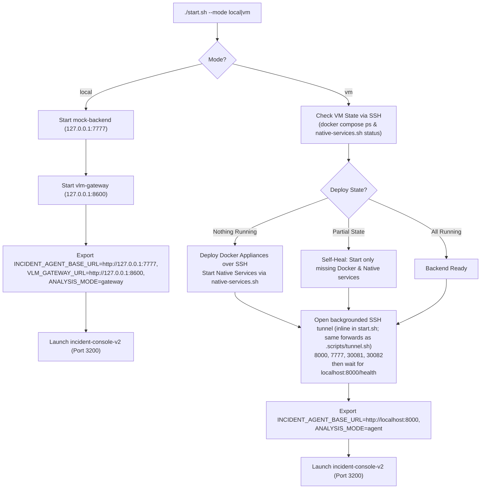
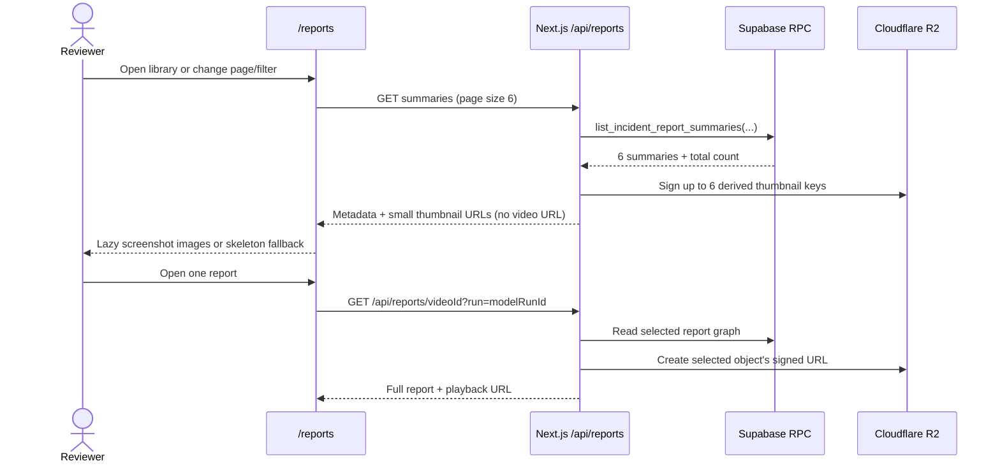
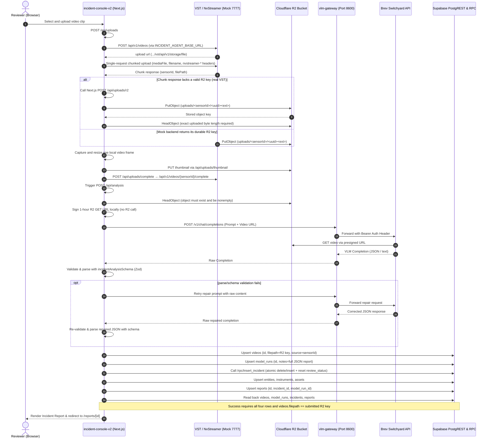
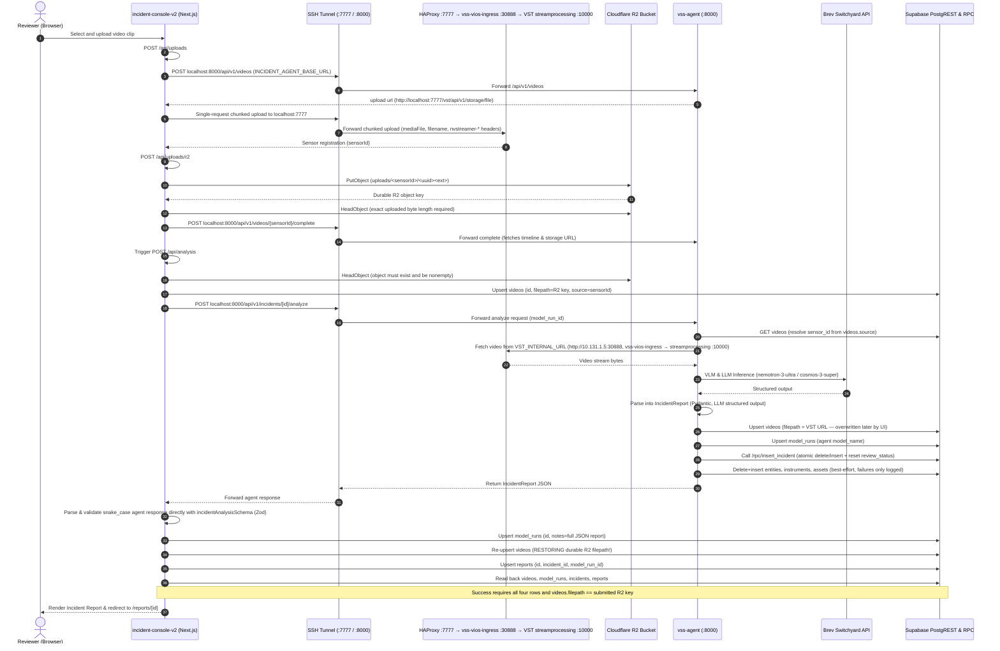
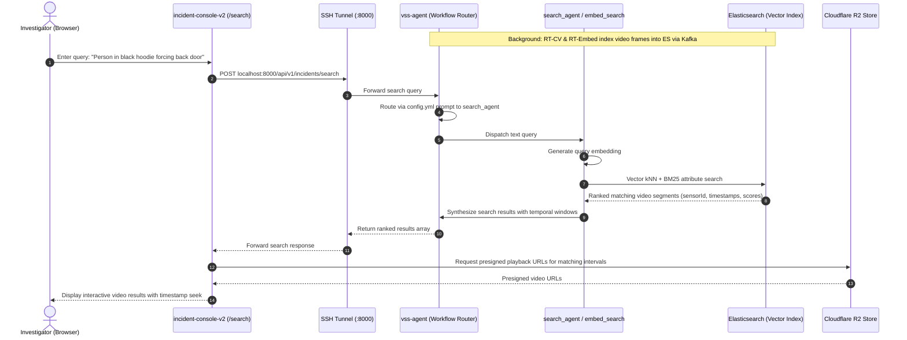

# Incident Search & Reporting Capstone — Architecture

This document describes the system architecture, component topology, deployment mechanics, and
runtime interaction sequences for `dev-profile-incident`.

---

## 1. System Context Architecture

The system spans three runtime tiers:
1. **Developer Laptop:** Hosts the modern frontend (`incident-console-v2`), local API proxies (`vlm-gateway`),
   and base mocks (`mock-backend`).
2. **Shared GPU Workstation (`kwanz-ws` VM):** Runs the heavy video ingestion appliance (VIOS/NvStreamer),
   infrastructure services in Docker, and the fast-iterating AI agent (`vss-agent`) as a native process.
3. **Cloud & External Services:** Cloudflare R2 for durable video storage, Supabase for relational data via
   HTTPS PostgREST, and hosted LLM/VLM inference endpoints (NGC and Brev).

### System Context Diagram

```mermaid
flowchart TB
    subgraph Laptop["Developer Laptop"]
        UI["incident-console-v2<br/>(Next.js App Router, Port 3200)"]
        Gateway["vlm-gateway<br/>(FastAPI Proxy, Port 8600)"]
        Mock["mock-backend<br/>(FastAPI Base Mock, Port 7777)"]
    end

    subgraph Tunnel["SSH Port Forwarding Tunnel"]
        FwdAgent["localhost:8000 -> VM:8000"]
        FwdHAProxy["localhost:7777 -> VM:7777"]
        FwdNIM["localhost:30081/30082 -> VM:30081/30082<br/>(Unused in Brev mode)"]
    end

    subgraph VM["kwanz-ws Shared Workstation"]
        subgraph VMNative["Native Processes (High Feasibility / Fast Restart)"]
            Agent["vss-agent<br/>(NAT Framework, Port 8000)"]
            VideoAnalytics["video-analytics-api<br/>(Optional, Port 8081)"]
            BehaviorAnalytics["behavior-analytics<br/>(Optional, no HTTP port; Kafka consumer)"]
        end

        subgraph VMDocker["Docker Appliances (Proprietary Toolchains / JVM / Infra)"]
            HAProxy["vss-haproxy-ingress<br/>(Port 7777)"]
            VIOSIngress["vss-vios-ingress<br/>(nginx, Port 30888)"]
            StreamProcessing["vss-vios-streamprocessing<br/>(VST storage API, Port 10000; all GPUs visible)"]
            VIOSSensor["vss-vios-sensor<br/>(Port 30000)"]
            NvStreamer["vss-vios-nvstreamer<br/>(RTSP streamer, Port 31000; GPU 0)"]
            VIOSPostgres["vss-vios-postgres<br/>(Internal DB, Unix socket only)"]
            Redis["redis<br/>(State Cache)"]
            Phoenix["phoenix<br/>(Telemetry, Port 6006)"]
            Kafka["kafka<br/>(Analytics Bus, always started by start.sh)"]
            Elasticsearch["elasticsearch<br/>(Search Index, Optional)"]
            RTVICV["vss-rtvi-cv<br/>(DeepStream Perception, Port 9000, MVP2)"]
            RTVIEmbed["vss-rtvi-embed<br/>(Triton Embeddings, Port 8017, GPU 1, MVP2)"]
        end
    end

    subgraph External["Cloud & Hosted Services"]
        R2[("Cloudflare R2<br/>(Video & Evidence Store)")]
        Supabase[("Supabase Postgres<br/>(HTTPS PostgREST & RPC)")]
        Brev["Brev Lab Switchyard API<br/>(https://switchyard-13doh4lsz.brevlab.com)"]
    end

    %% Laptop connections
    UI -->|Local Mode Inference| Gateway
    UI -->|Local Mode Upload| Mock
    UI -->|VM Mode HTTP /analyze| FwdAgent
    UI -->|VM Mode Video Upload| FwdHAProxy
    UI -->|Direct Upload Fallback & Presigned URLs| R2
    UI -->|REST /rpc/insert_incident| Supabase

    %% Gateway Upstream
    Gateway -->|Bearer Token Auth| Brev

    %% Tunnel Connections
    FwdAgent --> Agent
    FwdHAProxy --> HAProxy

    %% VM Internal Routing
    HAProxy --> VIOSIngress
    VIOSIngress --> StreamProcessing
    VIOSIngress --> VIOSSensor
    Agent -->|Fetch Video Bytes| VIOSIngress
    Agent -->|OpenAI Protocol Inference| Brev
    Agent -->|HTTPS PostgREST & RPC| Supabase
```



### Component Reference Table

| Component | Host | Port | Runtime Type | Primary Source / Owner File | Responsibility |
|---|---|---|---|---|---|
| `incident-console-v2` | Laptop | 3200 | Node.js (Next.js 15 App Router) | `incident-console-v2/` | Primary user interface: video upload, review workflow, eval form, report display |
| `vlm-gateway` | Laptop (or VM) | 8600 | Python (FastAPI / Uvicorn) | `vlm-gateway/app.py` | Holds Brev upstream credential server-side; exposes `/v1/chat/completions` for local mode |
| `mock-backend` | Laptop | 7777 | Python (FastAPI / Uvicorn) | `mock-backend/base_profile_mock/` | Zero-GPU local mock simulating VST upload, streaming, and base profile responses |
| `vss-agent` | `kwanz-ws` | 8000 | Python (Native `nat serve`) | `services/agent/` | Core VSS agent: incident analysis workflow, tool calling, report persistence; remote inference via Brev |
| `video-analytics-api` | `kwanz-ws` | 8081 | Node.js (Native) | `services/analytics/video-analytics-api/` | Optional MVP2 video analytics ingestion and query layer (`ENABLE_ANALYTICS=true`) |
| `behavior-analytics` | `kwanz-ws` | none (8080 is a HAProxy/label placeholder) | Python (Native) | `services/analytics/behavior-analytics/` | Optional MVP2 behavior perception pipeline (`ENABLE_ANALYTICS=true`) |
| `vss-haproxy-ingress` | `kwanz-ws` | 7777 | Docker container | `deploy/docker/services/infra/haproxy/` | Public reverse proxy on :7777: /api,/chat → vss-agent :8000; /vst,/storage → vss-vios-ingress :30888; /phoenix → :6006; optional analytics/kibana backends |
| `vss-vios-streamprocessing`| `kwanz-ws` | 10000 | Docker container (nvidia runtime, all GPUs) | `deploy/docker/services/vios/` | VST storage/upload + replay API (receives chunked uploads via the ingress) |
| `vss-vios-nvstreamer` | `kwanz-ws` | 31000 | Docker container (GPU 0) | `deploy/docker/developer-profiles/dev-profile-alerts/compose.yml` | NvStreamer RTSP file streamer (not in the upload path; not routed by ingress/HAProxy) |
| `vss-vios-ingress` | `kwanz-ws` | 30888 | Docker container | `deploy/docker/services/vios/` (foundational) | Nginx VST ingress: /vst/api/v1/sensor → sensor-ms :30000; other /vst/api/v1 and /vst/storage → streamprocessing :10000 |
| `vss-vios-sensor` | `kwanz-ws` | 30000 | Docker (nvidia runtime) | `deploy/docker/services/vios/initiator/` | VST sensor-ms (sensor registration; /vst/api/v1/sensor via ingress) |
| `vss-vios-postgres` | `kwanz-ws` | none (Unix socket only) | Docker container | `deploy/docker/services/vios/` | VIOS internal database for camera sensors and stream registrations |
| `vss-rtvi-cv` | `kwanz-ws` | 9000 | Docker container (GPU 0) | `deploy/docker/services/rtvi/` | DeepStream perception container for real-time video analytics (MVP2) |
| `vss-rtvi-embed` | `kwanz-ws` | 8017 (→8000) | Docker container (GPU 1, bridged) | `deploy/docker/services/rtvi/` | Triton inference server for real-time video embeddings (MVP2) |
| `redis` | `kwanz-ws` | 6379 (int) | Docker container | Stock compose infra | Message broker and caching layer |
| `phoenix` | `kwanz-ws` | 6006 (int) | Docker container (bridged mdx_default) | Stock compose infra | LLM/VLM telemetry, trace logging, and performance monitoring |
| `kafka` | `kwanz-ws` | 9092 | Docker container | Stock compose infra | Heavy event bus for analytics (always started by start.sh) |
| `elasticsearch` | `kwanz-ws` | Internal | Docker container | Stock compose infra | JVM search index appliance (optional, only with `ENABLE_ANALYTICS=true`) |
| `Supabase` | Cloud | 443 (HTTPS) | Managed PostgREST / Postgres | `supabase/migrations/` | Relational store for reports, incidents, evidence, reviews, and ground truth |
| `Cloudflare R2` | Cloud | 443 (HTTPS) | S3-Compatible Object Store | `incident-console-v2/lib/r2/` | Canonical persistent object storage for video clips and screenshots |
| `Brev Switchyard` | Cloud | 443 (HTTPS) | Remote Switchyard Proxy | Upstream endpoint | Hosted VLM/LLM inference used by both `vss-agent` (VM) and `vlm-gateway` (laptop) |

### Native vs. Docker Service Split Policy

**Policy Rule:** Run a service natively whenever feasible.

Services are split based on feasibility:
- **Native Processes (High Feasibility):** `vss-agent` (Python/uv), `video-analytics-api` (Node.js), and `behavior-analytics` (Python). Running natively eliminates Docker image rebuilds on code changes (~2s process restart vs multi-minute container build).
- **Docker Appliances (Infeasible Natively):** Media engines and perception services (`vss-vios-streamprocessing`, `vss-vios-nvstreamer`, `vss-vios-ingress`, `vss-vios-sensor`, `vss-vios-postgres`, `vss-rtvi-cv`, `vss-rtvi-embed`). These depend on proprietary CUDA, GStreamer, DeepStream, or Triton container toolchains; host installation is infeasible.
- **Docker Appliances (No Benefit / JVM):** Infrastructure appliances (`redis`, `kafka`, `elasticsearch`, `phoenix`, `vss-haproxy-ingress`). Standard prebuilt containers or heavy JVM runtimes where native execution provides no development benefit.
- **Networking:** Nearly all containers use host networking (`network_mode: host`); exceptions are `phoenix` (bridge `mdx_default`, published 6006:6006) and `vss-rtvi-embed` (published `${RTVI_EMBED_PORT}`=8017→8000). Native processes reach all of them on `localhost`.

---

## 2. Deployment & Connectivity

The one-command entry point for setting up and launching the system is `start.sh` (`./start.sh --mode local` or `./start.sh --mode vm`), executed directly from developer laptops. It automates backend checks, self-healing service deployment, port tunneling, and UI initialization.



### SSH Tunnel Port Forwards

When running in VM mode, `start.sh` opens a backgrounded SSH tunnel (the standalone equivalent is `.scripts/tunnel.sh`) forwarding the following
ports from `localhost` to `kwanz-ws` (`10.131.1.5`):

| Local Port | Remote Destination | Target Service | Usage |
|---|---|---|---|
| `8000` | `10.131.1.5:8000` | Native `vss-agent` | Agent REST API (`/health`, `POST /api/v1/incidents/{id}/analyze`) |
| `7777` | `10.131.1.5:7777` | `vss-haproxy-ingress` | VIOS/NvStreamer chunked upload and video storage API |
| `30081` | `10.131.1.5:30081` | LLM NIM Endpoint | Unused in remote (Brev) mode — nothing listens on the VM; only meaningful if a local LLM NIM is deployed |
| `30082` | `10.131.1.5:30082` | VLM NIM Endpoint | Unused in remote (Brev) mode — nothing listens on the VM; only meaningful if a local VLM NIM is deployed |

---

## 3. Remote LLM/VLM Deployment Facts (Brev Switchyard & Remote Inference)

The VM deployment runs LLM, VLM, and evaluation judge inference against Brev Switchyard (`https://switchyard-13doh4lsz.brevlab.com`),
eliminating the need for local NIM inference containers on `kwanz-ws` and avoiding NGC hosted endpoint rate-limits.

### Configuration Variables (`generated.env.remote`)

```dotenv
LLM_MODE=remote
VLM_MODE=remote
LLM_MODEL_TYPE=openai
VLM_MODEL_TYPE=openai
LLM_NAME=nvidia/nemotron-3-ultra
VLM_NAME=nvidia/cosmos-3-super-reasoner
LLM_NAME_SLUG=none
VLM_NAME_SLUG=none
LLM_BASE_URL=https://switchyard-13doh4lsz.brevlab.com
VLM_BASE_URL=https://switchyard-13doh4lsz.brevlab.com
LLM_ENDPOINT_URL=https://switchyard-13doh4lsz.brevlab.com
VLM_ENDPOINT_URL=https://switchyard-13doh4lsz.brevlab.com
OPENAI_API_KEY=<brev-switchyard-api-key>
```

### Inference Rules & Requirements

1. **Client Type Rule:** Use `_type: openai` for remote inference models, **never** `_type: nim`. The `nim_langchain` client leaks proprietary parameters (such as `verify_ssl`) into the HTTP JSON request body, which triggers HTTP 400 Bad Request errors on standard OpenAI-compatible endpoints.
2. **Model Selection Rules:**
   - **LLM (`nvidia/nemotron-3-ultra`):** Must support OpenAI tool calling (`bind_tools`) for `top_agent` and `json_schema` structured output for incident reporting. Also serves as `eval_llm_judge`.
   - **VLM (`nvidia/cosmos-3-super-reasoner`):** Must support base64 MP4 `video_url` inlining (`data:video/mp4;base64,...`) and frame-by-frame JPEG extraction.
3. **URL Format Rule:** Set `*_BASE_URL` without a trailing `/v1` (`https://switchyard-13doh4lsz.brevlab.com`). Agent and LangChain client instantiations append `/v1` automatically.
4. **Authentication Rule:** Set `OPENAI_API_KEY` to the Brev Switchyard key; it is shared across LLM, VLM, and `eval_llm_judge`.
5. **GPU Device Allocation:** nvstreamer is pinned to GPU 0 and streamprocessing/sensor see all GPUs (nvidia runtime). For MVP2, RT-CV uses GPU 0 (`RT_CV_DEVICE_ID=0`) and RT-Embed uses GPU 1 (`RT_EMBED_DEVICE_ID=1`). No local LLM/VLM NIM uses either GPU in remote mode.

---

## 4. Runtime Interaction Sequences

### Report library pagination and deferred report loading



### Sequence A: Upload, Analysis & Reporting in Gateway Mode (`ANALYSIS_MODE=gateway`)

*Zero-GPU local development flow using `vlm-gateway` and Cloudflare R2.*



---

### Sequence B: Upload, Analysis & Reporting in Agent Mode (`ANALYSIS_MODE=agent`)

*Full blueprint integration connecting laptop UI to native `vss-agent` on `kwanz-ws`.*



---

### Sequence C: Natural Language Video Search (Planned MVP2)

*Multi-subagent search workflow querying indexed Elasticsearch video embeddings.*

> [!NOTE]
> The search route `/api/v1/incidents/search` and the UI `/search` view are planned for MVP2. In `dev-profile-search`, search components (`search_agent`, `embed_search`, `attribute_search`, and `/api/v1/embed_search`) exist, but the VM incident profile currently loads `dev-profile-base`'s configuration which does not register them.


