# Incident Search & Reporting Capstone — Data Layer & Schema

This document defines the relational database schema (Supabase PostgreSQL), the object storage layout
(Cloudflare R2), and documented data layer edge cases in the `dev-profile-incident` architecture.

---

## 1. Supabase PostgreSQL Schema

The database schema is defined authoritatively by `deploy/docker/developer-profiles/dev-profile-incident/incident-console/db.py`
using SQLAlchemy Core (`metadata.create_all(checkfirst=True)`) and `deploy/docker/developer-profiles/dev-profile-incident/supabase/migrations/`
(applied via `supabase db push`, see [`../supabase/README.md`](../supabase/README.md)). It supports multi-model runs over
the same video, a parallel ground-truth evaluation structure, and human review workflows.

### Entity-Relationship Diagram

```mermaid
erDiagram
    VIDEOS {
        string id PK "String(20), 'v'+19hex or clip name, equals incident_id"
        string filepath "String(1024), R2 object key or legacy VST path"
        datetime uploaded_datetime "DateTime, naive UTC (DB default)"
        int duration "Integer, seconds"
        string source "String(512), sensorId"
    }

    QUERIES {
        string id PK "String(20)"
        text query_text "Text, user search query"
        datetime submitted_datetime "DateTime, naive UTC (DB default)"
    }

    MODEL_RUNS {
        string id PK "String(20)"
        string model_name "String(128)"
        string model_version "String(128)"
        string prompt_version "String(64)"
        datetime run_datetime "DateTime, naive UTC (DB default)"
        text notes "Text, v2 JSON / mock note / NULL"
    }

    INCIDENTS {
        string incident_id PK, FK "String(20) -> videos.id ON DELETE CASCADE"
        string model_run_id PK, FK "String(20) -> model_runs.id ON DELETE CASCADE"
        string type "String(32), free text"
        string start_timestamp "String(32), clock string (M:SS) or bare seconds"
        string end_timestamp "String(32), clock string (M:SS) or bare seconds"
        int duration "Integer, seconds"
        text description "Text, incident narrative"
        int severity_level "Integer, 1 to 5"
        float confidence_score "Double precision, 0.0 to 1.0"
    }

    REPORTS {
        string id PK "String(20)"
        string incident_id FK "String(20), composite FK -> incidents ON DELETE CASCADE"
        string query_id FK "String(20), nullable"
        string model_run_id FK "String(20), composite FK -> incidents ON DELETE CASCADE"
        string filepath "String(1024), artifact path (NULL or mock://)"
        datetime generated_datetime "DateTime, naive UTC (DB default)"
    }

    ENTITIES {
        string incident_id PK, FK "String(20), composite FK -> incidents ON DELETE CASCADE"
        string entity_id PK "String(20), E1 / e01 / sha256 / p..."
        string model_run_id PK, FK "String(20), composite FK -> incidents ON DELETE CASCADE"
        string type "String(16), free text (human/animal/unknown/person)"
        text description "Text, person/actor description"
        string image "String(1024), R2 evidence key (always NULL today)"
    }

    INSTRUMENTS {
        string incident_id PK, FK "String(20), composite FK -> incidents ON DELETE CASCADE"
        string instrument_id PK "String(20), I1 / i01 / sha256"
        string model_run_id PK, FK "String(20), composite FK -> incidents ON DELETE CASCADE"
        string entity_id "String(20), wielding entity"
        string name "String(256), tool or weapon name"
        text description "Text"
        int threat_level "Integer, 1 to 5 or null"
        string image "String(1024), R2 evidence key (always NULL today)"
    }

    ASSETS {
        string incident_id PK, FK "String(20), composite FK -> incidents ON DELETE CASCADE"
        string asset_id PK "String(20), A1 / a01 / sha256"
        string model_run_id PK, FK "String(20), composite FK -> incidents ON DELETE CASCADE"
        string name "String(256), property/vehicle name"
        text description "Text"
        string image "String(1024), R2 evidence key (always NULL today)"
    }

    REVIEW_STATUS {
        string incident_id PK, FK "String(20), composite FK -> incidents ON DELETE CASCADE"
        string model_run_id PK, FK "String(20), composite FK -> incidents ON DELETE CASCADE"
        string status "String(32), DB default 'unreviewed'"
        string verified_by "String(256), reviewer name"
        datetime verified_at "DateTime, naive UTC"
        string edited_by "String(256), editor name"
        datetime edited_at "DateTime, naive UTC"
    }

    NOTIFICATIONS {
        int id PK "Integer, autoincrement"
        string incident_id FK "String(20), composite FK -> incidents ON DELETE CASCADE"
        string model_run_id FK "String(20), composite FK -> incidents ON DELETE CASCADE"
        int severity "Integer, 1 to 5"
        datetime created_at "DateTime, naive UTC (DB default)"
        boolean acknowledged "Boolean, DB default false"
    }

    SEVERITY_EVAL_LOG {
        int id PK "Integer, autoincrement"
        string incident_id FK "String(20), composite FK -> incidents ON DELETE CASCADE"
        string model_run_id FK "String(20), composite FK -> incidents ON DELETE CASCADE"
        int ai_severity "Integer, 1 to 5"
        int human_severity "Integer, 1 to 5"
        string rater "String(256), rater name"
        datetime rated_at "DateTime, naive UTC (DB default)"
    }

    GT_INCIDENTS {
        string incident_id PK, FK "String(20) -> videos.id ON DELETE CASCADE"
        string type "String(32), free text"
        string start_timestamp "String(32), free text (bare seconds)"
        string end_timestamp "String(32), free text (bare seconds)"
        int duration "Integer"
        text description "Text"
        int severity_level "Integer, 1 to 5"
        string labelled_by "String(256)"
        datetime labelled_datetime "DateTime, naive UTC"
    }

    GT_ENTITIES {
        string incident_id PK, FK "String(20) -> gt_incidents.incident_id ON DELETE CASCADE"
        string entity_id PK "String(20)"
        string type "String(16)"
        text description "Text"
        string image "String(1024)"
    }

    GT_INSTRUMENTS {
        string incident_id PK, FK "String(20) -> gt_incidents.incident_id ON DELETE CASCADE"
        string instrument_id PK "String(20)"
        string entity_id "String(20)"
        string name "String(256)"
        text description "Text"
        int threat_level "Integer"
        string image "String(1024)"
    }

    GT_ASSETS {
        string incident_id PK, FK "String(20) -> gt_incidents.incident_id ON DELETE CASCADE"
        string asset_id PK "String(20)"
        string name "String(256)"
        text description "Text"
        string image "String(1024)"
    }

    ENTITY_MATCHES {
        string incident_id PK, FK "String(20)"
        string model_run_id PK, FK "String(20)"
        string entity_id PK, FK "String(20)"
        string gt_entity_id FK "String(20), NOT NULL"
        float similarity_score "Float"
        datetime matched_at "DateTime, naive UTC (DB default)"
    }

    INSTRUMENT_MATCHES {
        string incident_id PK, FK "String(20)"
        string model_run_id PK, FK "String(20)"
        string instrument_id PK, FK "String(20)"
        string gt_instrument_id FK "String(20), NOT NULL"
        float similarity_score "Float"
        datetime matched_at "DateTime, naive UTC (DB default)"
    }

    ASSET_MATCHES {
        string incident_id PK, FK "String(20)"
        string model_run_id PK, FK "String(20)"
        string asset_id PK, FK "String(20)"
        string gt_asset_id FK "String(20), NOT NULL"
        float similarity_score "Float"
        datetime matched_at "DateTime, naive UTC (DB default)"
    }

    VIDEOS ||--o{ INCIDENTS : "1 video = 1 incident (ON DELETE CASCADE)"
    VIDEOS ||--o{ GT_INCIDENTS : "has ground truth (ON DELETE CASCADE)"
    MODEL_RUNS ||--o{ INCIDENTS : "scores (ON DELETE CASCADE)"
    MODEL_RUNS ||--o{ REPORTS : "generates"
    INCIDENTS ||--o{ REPORTS : "summarized in (ON DELETE CASCADE)"
    QUERIES ||--o{ REPORTS : "originates from (ON DELETE SET NULL)"
    INCIDENTS ||--o{ ENTITIES : "contains (ON DELETE CASCADE)"
    INCIDENTS ||--o{ INSTRUMENTS : "involves (ON DELETE CASCADE)"
    INCIDENTS ||--o{ ASSETS : "impacts (ON DELETE CASCADE)"
    INCIDENTS ||--o| REVIEW_STATUS : "tracks review (ON DELETE CASCADE)"
    INCIDENTS ||--o{ NOTIFICATIONS : "triggers alerts (ON DELETE CASCADE)"
    INCIDENTS ||--o{ SEVERITY_EVAL_LOG : "evaluates (ON DELETE CASCADE)"
    GT_INCIDENTS ||--o{ GT_ENTITIES : "contains (ON DELETE CASCADE)"
    GT_INCIDENTS ||--o{ GT_INSTRUMENTS : "involves (ON DELETE CASCADE)"
    GT_INCIDENTS ||--o{ GT_ASSETS : "impacts (ON DELETE CASCADE)"
    ENTITIES ||--o{ ENTITY_MATCHES : "paired with GT (ON DELETE CASCADE)"
    GT_ENTITIES ||--o{ ENTITY_MATCHES : "referenced by (ON DELETE CASCADE)"
    INSTRUMENTS ||--o{ INSTRUMENT_MATCHES : "paired with GT (ON DELETE CASCADE)"
    GT_INSTRUMENTS ||--o{ INSTRUMENT_MATCHES : "referenced by (ON DELETE CASCADE)"
    ASSETS ||--o{ ASSET_MATCHES : "paired with GT (ON DELETE CASCADE)"
    GT_ASSETS ||--o{ ASSET_MATCHES : "referenced by (ON DELETE CASCADE)"
```



---

### Detailed Table Specifications

#### 1. Shared Reference Tables

##### `videos`
Primary registry of ingested video assets.
- **Identity Rule:** 1 video = 1 incident (`incidents.incident_id` == `videos.id`, no separate `video_id` column). `videos.id` serves as the natural primary key.

| Column | Type | Constraints | Description |
|---|---|---|---|
| `id` | `VARCHAR(20)` | PRIMARY KEY | Video identifier: `'v' + first 19 hex of sha256(sensorId)` for uploads (20 chars); clip-name ids (e.g. `Burglary012`, `RoadAccidents...`, `SYN-...`, `MOCK-...`) for fixture/eval rows. Equals `incident_id`. Raw sensor ids are never used directly as `id` since they can be up to 128 chars. |
| `filepath` | `VARCHAR(1024)` | NULLABLE | R2 object key (`uploads/<sensorId>/<uuid>.<ext>`, `anomaly/<category>/<clip>.mp4`, or `normal_videos/<clip>.mp4`). Not guaranteed: legacy v1-console rows may hold an absolute VST path (`/home/vst/...`), and the agent transiently overwrites it with the VST video URL during Analyze (v2 restores the R2 key afterwards). Validate with `isValidR2Key` before presigning. |
| `uploaded_datetime` | `TIMESTAMP` | DEFAULT (now() AT TIME ZONE 'utc') | Naive UTC timestamp (`timestamp without time zone`) when uploaded. Real DB default added in migration `20260925031000`; previously client-side SQLAlchemy `default=_utcnow` in `incident-console/db.py` only — PostgREST writers that omitted it received NULL (58/162 historical rows have NULL `uploaded_datetime`). |
| `duration` | `INTEGER` | NULLABLE | Video duration in integer seconds |
| `source` | `VARCHAR(512)` | NULLABLE | Sensor ID, ingestion source, or camera stream name |

##### `queries`
Tracks natural language queries submitted by users (MVP2 search).

| Column | Type | Constraints | Description |
|---|---|---|---|
| `id` | `VARCHAR(20)` | PRIMARY KEY | Unique query identifier |
| `query_text` | `TEXT` | NOT NULL | Natural language query string |
| `submitted_datetime` | `TIMESTAMP` | DEFAULT (now() AT TIME ZONE 'utc') | Naive UTC timestamp when submitted (DB default added in migration `20260925031000`) |

##### `model_runs`
Tracks each execution of an AI pipeline run over an incident video.

| Column | Type | Constraints | Description |
|---|---|---|---|
| `id` | `VARCHAR(20)` | PRIMARY KEY | Unique model execution identifier |
| `model_name` | `VARCHAR(128)` | NOT NULL | Model identifier (e.g. `nvidia/cosmos-3-nano-reasoner`, `incident_report_gen`, `vss-agent`) |
| `model_version` | `VARCHAR(128)` | NULLABLE | Optional version tag of the model |
| `prompt_version` | `VARCHAR(64)` | NULLABLE | Prompt template version tag |
| `run_datetime` | `TIMESTAMP` | DEFAULT (now() AT TIME ZONE 'utc') | Naive UTC execution timestamp (DB default added in migration `20260925031000`) |
| `notes` | `TEXT` | NULLABLE | Free text, nullable. `incident-console-v2` stores JSON `{"incidentConsoleV2":{report,rawModelOutput,normalizedModelOutput}}`; `mock-backend` stores a plain-text note (`MOCK output generated by base_profile_mock...`); agent/seed/eval runs leave it NULL. |

---

#### 2. Model Output Tables

##### `incidents`
AI-extracted incident intelligence for a specific model run over a video.

| Column | Type | Constraints | Description |
|---|---|---|---|
| `incident_id` | `VARCHAR(20)` | PRIMARY KEY, FK -> `videos.id` ON DELETE CASCADE | Associated video/incident identifier |
| `model_run_id` | `VARCHAR(20)` | PRIMARY KEY, FK -> `model_runs.id` ON DELETE CASCADE | Model run identifier |
| `type` | `VARCHAR(32)` | NULLABLE | Free text (VARCHAR(32)); intended taxonomy `road accident`, `burglary`, `explosion`, `fighting`, `animal` is prompt-level only, not enforced by DB CHECK constraint or application validator — live data also holds `assault`, `animal attack`, `other`, NULL, etc. |
| `start_timestamp` | `VARCHAR(32)` | NULLABLE | Free text: either a clock string (`M:SS` / `H:MM:SS`, agent & console) or bare seconds (e.g. `"21"`, `"15.6"`, eval/P1 and `gt_*` rows). Consumers must accept both (see `eval_gt._timestamp_seconds`). |
| `end_timestamp` | `VARCHAR(32)` | NULLABLE | Free text: either a clock string (`M:SS` / `H:MM:SS`, agent & console) or bare seconds (e.g. `"21"`, `"15.6"`, eval/P1 and `gt_*` rows). Consumers must accept both (see `eval_gt._timestamp_seconds`). |
| `duration` | `INTEGER` | NULLABLE | Incident duration in seconds |
| `description` | `TEXT` | NULLABLE | Narrative summary of the incident |
| `severity_level` | `INTEGER` | NULLABLE | Severity score (1 to 5) |
| `confidence_score`| `DOUBLE PRECISION` | NULLABLE | Model confidence score (0.0 to 1.0). The column has always been `DOUBLE PRECISION`; migration `20260925031000` widened the `insert_incident` RPC parameter `p_confidence_score` from `REAL` to `DOUBLE PRECISION`, so rows written through the old RPC may still hold float4-rounded values. |

##### `reports`
Artifact pointer table linking an incident and model run to external files or queries.

| Column | Type | Constraints | Description |
|---|---|---|---|
| `id` | `VARCHAR(20)` | PRIMARY KEY | Report record identifier |
| `incident_id` | `VARCHAR(20)` | NOT NULL; composite FK `(incident_id, model_run_id)` -> `incidents` ON DELETE CASCADE | Linked incident identifier |
| `query_id` | `VARCHAR(20)` | NULLABLE, FK -> `queries.id` ON DELETE SET NULL | Triggering search query (always NULL today) |
| `model_run_id` | `VARCHAR(20)` | NOT NULL; composite FK `(incident_id, model_run_id)` -> `incidents` ON DELETE CASCADE | Linked model run identifier |
| `filepath` | `VARCHAR(1024)` | NULLABLE | Optional path to rendered report artifact: NULL (`incident-console-v2`) or `mock://reports/<file>` (`mock-backend`). |
| `generated_datetime`| `TIMESTAMP` | DEFAULT (now() AT TIME ZONE 'utc') | Naive UTC generation timestamp (DB default added in migration `20260925031000`) |

##### `entities`
Observed actors or persons extracted by the model during a specific run.

| Column | Type | Constraints | Description |
|---|---|---|---|
| `incident_id` | `VARCHAR(20)` | PRIMARY KEY; composite FK `(incident_id, model_run_id)` -> `incidents` ON DELETE CASCADE | Linked incident identifier |
| `entity_id` | `VARCHAR(20)` | PRIMARY KEY | Writer-specific id: `E1`/`E2` (seed/eval), `e01`/`e02` (console-v2 gateway), `e` + 19 hex sha256 (agent), `p...` (mock). |
| `model_run_id` | `VARCHAR(20)` | PRIMARY KEY; composite FK `(incident_id, model_run_id)` -> `incidents` ON DELETE CASCADE | Linked model run identifier |
| `type` | `VARCHAR(16)` | NULLABLE | Free text (VARCHAR(16)): `human` / `animal` / `unknown` from console/seed; the agent writes `"person"`. |
| `description` | `TEXT` | NULLABLE | Visual description and observed actions |
| `image` | `VARCHAR(1024)` | NULLABLE | R2 object key for cropped evidence screenshot (schema-only, always NULL today) |

##### `instruments`
Observed tools, objects, or weapons extracted by the model.

| Column | Type | Constraints | Description |
|---|---|---|---|
| `incident_id` | `VARCHAR(20)` | PRIMARY KEY; composite FK `(incident_id, model_run_id)` -> `incidents` ON DELETE CASCADE | Linked incident identifier |
| `instrument_id`| `VARCHAR(20)` | PRIMARY KEY | Writer-specific id: `I1` (seed/eval), `i01` (console-v2 gateway), `i` + 19 hex sha256 (agent). |
| `model_run_id` | `VARCHAR(20)` | PRIMARY KEY; composite FK `(incident_id, model_run_id)` -> `incidents` ON DELETE CASCADE | Linked model run identifier |
| `entity_id` | `VARCHAR(20)` | NULLABLE | Wielding entity identifier (if identified) |
| `name` | `VARCHAR(256)` | NULLABLE | Instrument name (e.g. `crowbar`, `knife`) |
| `description` | `TEXT` | NULLABLE | Contextual usage description |
| `threat_level` | `INTEGER` | NULLABLE | Threat rating (1 to 5, or NULL when not rated) |
| `image` | `VARCHAR(1024)` | NULLABLE | R2 object key for cropped evidence screenshot (always NULL today) |

##### `assets`
Observed physical property, infrastructure, or vehicles extracted by the model.

| Column | Type | Constraints | Description |
|---|---|---|---|
| `incident_id` | `VARCHAR(20)` | PRIMARY KEY; composite FK `(incident_id, model_run_id)` -> `incidents` ON DELETE CASCADE | Linked incident identifier |
| `asset_id` | `VARCHAR(20)` | PRIMARY KEY | Writer-specific id: `A1` (seed/eval), `a01` (console-v2 gateway), `a` + 19 hex sha256 (agent). |
| `model_run_id` | `VARCHAR(20)` | PRIMARY KEY; composite FK `(incident_id, model_run_id)` -> `incidents` ON DELETE CASCADE | Linked model run identifier |
| `name` | `VARCHAR(256)` | NULLABLE | Asset name (e.g. `cash register`, `sedan`) |
| `description` | `TEXT` | NULLABLE | Observed physical damage or involvement |
| `image` | `VARCHAR(1024)` | NULLABLE | R2 object key for cropped evidence screenshot (always NULL today) |

---

#### 3. Review Workflow & Operational Tables

##### `review_status`
Carries the reviewer verification state independently of the AI report.

| Column | Type | Constraints | Description |
|---|---|---|---|
| `incident_id` | `VARCHAR(20)` | PRIMARY KEY; composite FK `(incident_id, model_run_id)` -> `incidents` ON DELETE CASCADE | Linked incident identifier |
| `model_run_id` | `VARCHAR(20)` | PRIMARY KEY; composite FK `(incident_id, model_run_id)` -> `incidents` ON DELETE CASCADE | Linked model run identifier |
| `status` | `VARCHAR(32)` | NOT NULL, DEFAULT `'unreviewed'` | State (`unreviewed`, `under review`, `verified`). Real DB default `'unreviewed'` added in migration `20260925031000`. |
| `verified_by` | `VARCHAR(256)` | NULLABLE | Reviewer username who verified the report |
| `verified_at` | `TIMESTAMP` | NULLABLE | Naive UTC timestamp of verification |
| `edited_by` | `VARCHAR(256)` | NULLABLE | Editor username who modified report fields |
| `edited_at` | `TIMESTAMP` | NULLABLE | Naive UTC timestamp of last edit |

##### `notifications`
Alert queue: one row is written when a reviewer moves an incident to `'verified'` and its `severity_level >= threshold` (console: `INCIDENT_SEVERITY_NOTIFY_THRESHOLD`, default 4; v2: hard-coded 4). Detection alone never notifies.

| Column | Type | Constraints | Description |
|---|---|---|---|
| `id` | `INTEGER` | PRIMARY KEY, AUTOINCREMENT | Unique notification identifier |
| `incident_id` | `VARCHAR(20)` | composite FK `(incident_id, model_run_id)` -> `incidents` ON DELETE CASCADE | Associated incident |
| `model_run_id` | `VARCHAR(20)` | composite FK `(incident_id, model_run_id)` -> `incidents` ON DELETE CASCADE | Associated model run |
| `severity` | `INTEGER` | NULLABLE | Triggering severity rating (typically >= 4) |
| `created_at` | `TIMESTAMP` | DEFAULT (now() AT TIME ZONE 'utc') | Alert creation timestamp (naive UTC, DB default added in migration `20260925031000`) |
| `acknowledged` | `BOOLEAN` | NOT NULL, DEFAULT FALSE | Reviewer acknowledgement status (DB default added in migration `20260925031000`) |

##### `severity_eval_log`
Tracks comparative human vs. AI severity scoring for human-in-the-loop evaluation.

| Column | Type | Constraints | Description |
|---|---|---|---|
| `id` | `INTEGER` | PRIMARY KEY, AUTOINCREMENT | Log entry identifier |
| `incident_id` | `VARCHAR(20)` | composite FK `(incident_id, model_run_id)` -> `incidents` ON DELETE CASCADE | Associated incident |
| `model_run_id` | `VARCHAR(20)` | composite FK `(incident_id, model_run_id)` -> `incidents` ON DELETE CASCADE | Associated model run |
| `ai_severity` | `INTEGER` | NULLABLE | Severity score produced by the AI |
| `human_severity`| `INTEGER` | NULLABLE | Severity score assigned by human reviewer |
| `rater` | `VARCHAR(256)` | NULLABLE | Evaluator name |
| `rated_at` | `TIMESTAMP` | DEFAULT (now() AT TIME ZONE 'utc') | Evaluation timestamp (naive UTC, DB default added in migration `20260925031000`) |

---

#### 4. Ground-Truth (GT) & Evaluation Matching Tables

##### `gt_incidents`, `gt_entities`, `gt_instruments`, `gt_assets`
Parallel tables mirroring `incidents`, `entities`, `instruments`, and `assets`, but without
`model_run_id`. They store verified human annotations.
- `gt_incidents.type`: Free text (`VARCHAR(32)`).
- `gt_incidents.start_timestamp` / `end_timestamp`: Free text (`VARCHAR(32)`), storing bare seconds (e.g. `"21"`, `"15.6"`).
- `gt_incidents` includes `labelled_by` and `labelled_datetime` (naive UTC) instead of AI confidence/model fields.
- `gt_entities`, `gt_instruments`, and `gt_assets` reference `gt_incidents(incident_id)` with `ON DELETE CASCADE` (they reference `gt_incidents`, not `videos` or `incidents`).
- `image` columns in `gt_*` tables are schema-only and always NULL today.

##### `entity_matches`, `instrument_matches`, `asset_matches`
Store accepted (above-threshold) similarity pairings produced during Tier 1 ground-truth evaluation
(`incident-console/matching.py`).
- **Composite Primary Key:** `(incident_id, model_run_id, <item>_id)`
- **Foreign Keys:** References model items (`entities`/`instruments`/`assets`) and ground-truth items (`gt_*`)
  with `ON DELETE CASCADE`. The `gt_*_id` foreign key columns (`gt_entity_id`, `gt_instrument_id`, `gt_asset_id`) are `NOT NULL`.
- **Columns:** `similarity_score` (`FLOAT`, NOT NULL), `matched_at` (`TIMESTAMP`, naive UTC, `DEFAULT (now() AT TIME ZONE 'utc')`).

---

### The `insert_incident` Postgres RPC Function

Because Supabase PostgREST does not support multi-statement client-held transactions or `SELECT ... FOR UPDATE`,
the atomic operation of saving an incident report is executed server-side via the stored procedure
`insert_incident` (`supabase/migrations/20260917141225_insert_incident_function.sql`, updated with `DOUBLE PRECISION` in `20260925031000_schema_defaults_and_precision.sql`):

```sql
CREATE OR REPLACE FUNCTION insert_incident(
    p_incident_id TEXT,
    p_model_run_id TEXT,
    p_type TEXT,
    p_start_timestamp TEXT,
    p_end_timestamp TEXT,
    p_duration INTEGER,
    p_description TEXT,
    p_severity_level INTEGER,
    p_confidence_score DOUBLE PRECISION
) RETURNS VOID LANGUAGE plpgsql AS $$
BEGIN
    DELETE FROM incidents
    WHERE incident_id = p_incident_id AND model_run_id = p_model_run_id;

    INSERT INTO incidents (
        incident_id, model_run_id, type, start_timestamp, end_timestamp,
        duration, description, severity_level, confidence_score
    ) VALUES (
        p_incident_id, p_model_run_id, p_type, p_start_timestamp, p_end_timestamp,
        p_duration, p_description, p_severity_level, p_confidence_score
    );

    DELETE FROM review_status
    WHERE incident_id = p_incident_id AND model_run_id = p_model_run_id;

    INSERT INTO review_status (incident_id, model_run_id, status)
    VALUES (p_incident_id, p_model_run_id, 'unreviewed');
END;
$$;
```

This ensures that re-analyzing an incident atomically replaces the previous report for that run ID
and resets review status to `'unreviewed'` in a single database transaction.

> [!IMPORTANT]
> **Cascading Deletes on Child Records:**
> Because every child table's composite foreign key `(incident_id, model_run_id)` to `incidents` is configured with `ON DELETE CASCADE`, the RPC's initial `DELETE FROM incidents` also silently cascades and deletes all related `entities`, `instruments`, `assets`, `reports`, `review_status`, `notifications`, `severity_eval_log`, and `*_matches` rows for that `(incident_id, model_run_id)`. Re-analyzing under the same `model_run_id` therefore wipes all child evidence, reports, notifications, and GT match records. Callers must re-insert evidence rows after calling the RPC (both the agent's `_persist_incident` and `incident-console-v2`'s `/api/analysis` do so explicitly).

> [!NOTE]
> **Cascades on Deleting Videos or Model Runs:**
> Foreign keys `videos -> incidents` and `videos -> gt_incidents` are `ON DELETE CASCADE`. Deleting a `videos` row (e.g. via `incident-console-v2/app/api/reports/[videoId]/delete/route.ts`) cascades to delete all model runs, evidence, GT rows, and evaluation matches for that video. Similarly, `model_runs -> incidents` is `ON DELETE CASCADE`; deleting a `model_runs` row wipes every incident scored under it (`insert_model_run` deliberately upserts for that reason).

---

### Client Access Models & PostgREST/Direct-Postgres Split

Database access is split across two client implementations according to operational requirements:

1. **Console & Tooling (Direct Postgres):**
   `incident-console/db.py` uses direct Postgres via SQLAlchemy Core and `psycopg2`. Configuration is `INCIDENT_DB_DSN`.
   The console is database-backed only; there is no offline CSV-preview UI mode.

2. **Agent Side & Service Writers (Supabase PostgREST):**
   `services/agent/src/vss_agents/utils/incident_db.py` is the agent-side counterpart: an async Supabase
   PostgREST CRUD helper (`supabase-py`'s `AsyncClient`/`acreate_client`, not `asyncpg`/direct-Postgres) against
   the same schema, mirroring `incident-console/db.py`'s tables and columns for the subset an agent-side caller plausibly writes
   (`videos`, `model_runs`, `incidents`, `entities`, `instruments`, `assets`, `reports`, `review_status`, `notifications`; the `gt_*` and
   `*_matches` tables stay console/eval-only).
   - **Configuration:** `INCIDENT_SUPABASE_URL` and `INCIDENT_SUPABASE_SERVICE_ROLE_KEY`
     (deliberately NOT `INCIDENT_DB_DSN`, which stays owned by the console's own `incident-console/db.py`); unset means the feature is
     unavailable, no fallback.
   - **Network Constraint / DPI Blocking Rationale:** This split exists because the deployment VM (`kwanz-ws`) DPI-blocks raw Postgres wire
     protocol on port 5432, so only the HTTPS-based PostgREST route works for the agent from there — a direct-Postgres
     driver on the agent side breaks Analyze on `kwanz-ws`.
   - **Transaction Limits & RPC:** PostgREST has no client-held transactions or `SELECT ... FOR UPDATE`; all PostgREST writers
     (`services/agent/src/vss_agents/utils/incident_db.py`, `incident-console-v2/lib/postgrest/client.ts`, `incident-console/db_postgrest.py`,
     and `eval/db_postgrest.py`) call the atomic `insert_incident` Postgres RPC function
     (`deploy/docker/developer-profiles/dev-profile-incident/supabase/migrations/`) via `/rpc/insert_incident` (see [`../supabase/README.md`](../supabase/README.md)
     for how to apply it via `supabase db push`).

### Fixture CSV Seed Data Quirk

Fixture data in `deploy/docker/developer-profiles/dev-profile-incident/incident-console/fixtures/data/*.csv`
(72 rows on disk, 36 real + 36 synthetic `SYN-`-prefixed placeholders with no matching R2 video) is the seed source for the Postgres importer
(`deploy/docker/developer-profiles/dev-profile-incident/incident-console/scripts/seed_supabase.py` via `incident-console/scripts/seed_data.py`), which drops the `SYN-`-prefixed rows and seeds only the
36 real incidents under one shared `model_run_id`.

---

## 2. Cloudflare R2 Storage Architecture

Cloudflare R2 provides S3-compatible, permanent object storage for all video media and evidence images.
Local disks on `kwanz-ws` are treated as temporary caches only (though VST stores ingested video files locally).

### Bucket Key Tree Layout

```
anomaly-detection-dataset/            # bucket name comes from R2_BUCKET
├── anomaly/                         # dataset clips (seed/eval) AND mock-backend uploads
│   ├── animal_attacks/  assault/  burglary/  explosion/
│   ├── fighting/  road_accidents/  shooting/
│   │   └── <clip-name>.mp4          # mock-backend writes anomaly/<hash-picked category>/<original filename>
├── normal_videos/                   # baseline non-incident clips
│   └── <clip-name>.mp4
├── uploads/                         # incident-console-v2 real-VST uploads (/api/uploads/r2)
│   └── <encodeURIComponent(sensorId)>/<uuid>.<ext>   # ext lowercased, default .mp4
├── Report/                          # empty folder marker, unused by code
└── evidence/                        # planned, not created; entities/instruments/assets.image are always NULL today
    └── <incidentId>/{entities,instruments,assets}/<id>.jpg
```

> [!NOTE]
> The `anomaly/` subfolders are actively used: `mock-backend` (local mode) uploads videos to `anomaly/<category>/<original filename>`, where the category is picked by hash (`sha256(incident_id)[0] % 5`), not by video content.
> In addition to the five fixture categories, live R2 storage includes `assault/` and `shooting/`.
> The `Report/` prefix is a 0-byte directory marker and is unused by code.
> The `evidence/` tree is planned for cropped entity/instrument/asset evidence thumbnails, but `image` columns are always NULL in the database today.

### Key Validation & Generation Rules

1. **Validity Rule (`isValidR2Key` in `incident-console-v2/lib/r2/key.ts`):**
   A valid R2 object key must:
   - Be a non-empty string.
   - Not start with `/` (absolute filesystem path).
   - Not start with `.` or contain `..` (relative filesystem path).
   - Guard against VST/NvStreamer `filePath` outputs (which return `./streamer/media/...` or local file paths).
2. **Upload Key Pattern:**
   Direct uploads from `incident-console-v2/app/api/uploads/r2/route.ts` format keys as:
   `uploads/${encodeURIComponent(sensorId.trim())}/${randomUUID()}${ext}`.
3. **Presigned Playback URLs:**
   Access is private by default. Playback URLs are generated server-side using AWS SDK S3 client
   presigning (`getSignedUrl` with `GetObjectCommand`, `ResponseContentDisposition: 'inline'`, and a 1-hour
   expiration window).

---

For known schema issues, dual-writer architecture compromises, and technical debt, see [`status.md`](status.md).
