# Incident Search & Reporting Capstone — Data Layer & Schema

This document defines the relational database schema (Supabase PostgreSQL), the object storage layout
(Cloudflare R2), and documented data layer edge cases in the `dev-profile-incident` architecture.

---

## 1. Supabase PostgreSQL Schema

The database schema is defined authoritatively by `deploy/docker/developer-profiles/dev-profile-incident/incident-console/db.py`
using SQLAlchemy Core (`metadata.create_all(checkfirst=True)`). It supports multi-model runs over
the same video, a parallel ground-truth evaluation structure, and human review workflows.

### Entity-Relationship Diagram

```mermaid
erDiagram
    VIDEOS {
        string id PK "String(20), matches incident_id"
        string filepath "String(1024), R2 object key"
        datetime uploaded_datetime "DateTime, UTC"
        int duration "Integer, seconds"
        string source "String(512), sensorId"
    }

    QUERIES {
        string id PK "String(20)"
        text query_text "Text, user search query"
        datetime submitted_datetime "DateTime, UTC"
    }

    MODEL_RUNS {
        string id PK "String(20)"
        string model_name "String(128)"
        string model_version "String(128)"
        string prompt_version "String(64)"
        datetime run_datetime "DateTime, UTC"
        text notes "Text, holds serialized report JSON"
    }

    INCIDENTS {
        string incident_id PK, FK "String(20) -> videos.id"
        string model_run_id PK, FK "String(20) -> model_runs.id"
        string type "String(32), controlled taxonomy"
        string start_timestamp "String(32), HH:MM:SS or M:SS"
        string end_timestamp "String(32), HH:MM:SS or M:SS"
        int duration "Integer, seconds"
        text description "Text, incident narrative"
        int severity_level "Integer, 1 to 5"
        float confidence_score "Float, 0.0 to 1.0"
    }

    REPORTS {
        string id PK "String(20)"
        string incident_id FK "String(20)"
        string query_id FK "String(20), nullable"
        string model_run_id FK "String(20)"
        string filepath "String(1024), artifact path"
        datetime generated_datetime "DateTime, UTC"
    }

    ENTITIES {
        string incident_id PK, FK "String(20)"
        string entity_id PK "String(20)"
        string model_run_id PK, FK "String(20)"
        string type "String(16), human/animal/unknown"
        text description "Text, person/actor description"
        string image "String(1024), R2 evidence key"
    }

    INSTRUMENTS {
        string incident_id PK, FK "String(20)"
        string instrument_id PK "String(20)"
        string model_run_id PK, FK "String(20)"
        string entity_id "String(20), wielding entity"
        string name "String(256), tool or weapon name"
        text description "Text"
        int threat_level "Integer, 1 to 5 or null"
        string image "String(1024), R2 evidence key"
    }

    ASSETS {
        string incident_id PK, FK "String(20)"
        string asset_id PK "String(20)"
        string model_run_id PK, FK "String(20)"
        string name "String(256), property/vehicle name"
        text description "Text"
        string image "String(1024), R2 evidence key"
    }

    REVIEW_STATUS {
        string incident_id PK, FK "String(20)"
        string model_run_id PK, FK "String(20)"
        string status "String(32), unreviewed/under review/verified"
        string verified_by "String(256), reviewer name"
        datetime verified_at "DateTime, UTC"
        string edited_by "String(256), editor name"
        datetime edited_at "DateTime, UTC"
    }

    NOTIFICATIONS {
        int id PK "Integer, autoincrement"
        string incident_id FK "String(20)"
        string model_run_id FK "String(20)"
        int severity "Integer, 1 to 5"
        datetime created_at "DateTime, UTC"
        boolean acknowledged "Boolean, default false"
    }

    SEVERITY_EVAL_LOG {
        int id PK "Integer, autoincrement"
        string incident_id FK "String(20)"
        string model_run_id FK "String(20)"
        int ai_severity "Integer, 1 to 5"
        int human_severity "Integer, 1 to 5"
        string rater "String(256), rater name"
        datetime rated_at "DateTime, UTC"
    }

    GT_INCIDENTS {
        string incident_id PK, FK "String(20) -> videos.id"
        string type "String(32)"
        string start_timestamp "String(32)"
        string end_timestamp "String(32)"
        int duration "Integer"
        text description "Text"
        int severity_level "Integer, 1 to 5"
        string labelled_by "String(256)"
        datetime labelled_datetime "DateTime, UTC"
    }

    GT_ENTITIES {
        string incident_id PK, FK "String(20)"
        string entity_id PK "String(20)"
        string type "String(16)"
        text description "Text"
        string image "String(1024)"
    }

    GT_INSTRUMENTS {
        string incident_id PK, FK "String(20)"
        string instrument_id PK "String(20)"
        string entity_id "String(20)"
        string name "String(256)"
        text description "Text"
        int threat_level "Integer"
        string image "String(1024)"
    }

    GT_ASSETS {
        string incident_id PK, FK "String(20)"
        string asset_id PK "String(20)"
        string name "String(256)"
        text description "Text"
        string image "String(1024)"
    }

    ENTITY_MATCHES {
        string incident_id PK, FK "String(20)"
        string model_run_id PK, FK "String(20)"
        string entity_id PK, FK "String(20)"
        string gt_entity_id FK "String(20)"
        float similarity_score "Float"
        datetime matched_at "DateTime, UTC"
    }

    INSTRUMENT_MATCHES {
        string incident_id PK, FK "String(20)"
        string model_run_id PK, FK "String(20)"
        string instrument_id PK, FK "String(20)"
        string gt_instrument_id FK "String(20)"
        float similarity_score "Float"
        datetime matched_at "DateTime, UTC"
    }

    ASSET_MATCHES {
        string incident_id PK, FK "String(20)"
        string model_run_id PK, FK "String(20)"
        string asset_id PK, FK "String(20)"
        string gt_asset_id FK "String(20)"
        float similarity_score "Float"
        datetime matched_at "DateTime, UTC"
    }

    VIDEOS ||--o{ INCIDENTS : "1 video = 1 incident"
    VIDEOS ||--o{ GT_INCIDENTS : "has ground truth"
    MODEL_RUNS ||--o{ INCIDENTS : "scores"
    MODEL_RUNS ||--o{ REPORTS : "generates"
    INCIDENTS ||--o{ REPORTS : "summarized in"
    QUERIES ||--o{ REPORTS : "originates from"
    INCIDENTS ||--o{ ENTITIES : "contains"
    INCIDENTS ||--o{ INSTRUMENTS : "involves"
    INCIDENTS ||--o{ ASSETS : "impacts"
    INCIDENTS ||--|| REVIEW_STATUS : "tracks review"
    INCIDENTS ||--o{ NOTIFICATIONS : "triggers alerts"
    INCIDENTS ||--o{ SEVERITY_EVAL_LOG : "evaluates"
    GT_INCIDENTS ||--o{ GT_ENTITIES : "contains"
    GT_INCIDENTS ||--o{ GT_INSTRUMENTS : "involves"
    GT_INCIDENTS ||--o{ GT_ASSETS : "impacts"
    ENTITIES ||--o{ ENTITY_MATCHES : "paired with GT"
    GT_ENTITIES ||--o{ ENTITY_MATCHES : "referenced by"
    INSTRUMENTS ||--o{ INSTRUMENT_MATCHES : "paired with GT"
    GT_INSTRUMENTS ||--o{ INSTRUMENT_MATCHES : "referenced by"
    ASSETS ||--o{ ASSET_MATCHES : "paired with GT"
    GT_ASSETS ||--o{ ASSET_MATCHES : "referenced by"
```



---

### Detailed Table Specifications

#### 1. Shared Reference Tables

##### `videos`
Primary registry of ingested video assets.
- **Identity Rule:** `videos.id` serves as the natural primary key and is identical to `incidents.incident_id`. There is no separate `video_id`.

| Column | Type | Constraints | Description |
|---|---|---|---|
| `id` | `VARCHAR(20)` | PRIMARY KEY | Video identifier (compact hash or sensor id), equals `incident_id` |
| `filepath` | `VARCHAR(1024)` | NULLABLE | Durable Cloudflare R2 object key (e.g. `uploads/<sensorId>/<uuid>.mp4`) |
| `uploaded_datetime` | `TIMESTAMP` | DEFAULT UTC NOW | UTC timestamp when uploaded |
| `duration` | `INTEGER` | NULLABLE | Video duration in integer seconds |
| `source` | `VARCHAR(512)` | NULLABLE | Sensor ID, ingestion source, or camera stream name |

##### `queries`
Tracks natural language queries submitted by users (MVP2 search).

| Column | Type | Constraints | Description |
|---|---|---|---|
| `id` | `VARCHAR(20)` | PRIMARY KEY | Unique query identifier |
| `query_text` | `TEXT` | NOT NULL | Natural language query string |
| `submitted_datetime` | `TIMESTAMP` | DEFAULT UTC NOW | UTC timestamp when submitted |

##### `model_runs`
Tracks each execution of an AI pipeline run over an incident video.

| Column | Type | Constraints | Description |
|---|---|---|---|
| `id` | `VARCHAR(20)` | PRIMARY KEY | Unique model execution identifier |
| `model_name` | `VARCHAR(128)` | NOT NULL | Model identifier (e.g. `nvidia/cosmos-3-nano-reasoner`) |
| `model_version` | `VARCHAR(128)` | NULLABLE | Optional version tag of the model |
| `prompt_version` | `VARCHAR(64)` | NULLABLE | Prompt template version tag |
| `run_datetime` | `TIMESTAMP` | DEFAULT UTC NOW | Execution timestamp |
| `notes` | `TEXT` | NULLABLE | JSON-serialized dictionary containing complete raw and normalized report output |

---

#### 2. Model Output Tables

##### `incidents`
AI-extracted incident intelligence for a specific model run over a video.

| Column | Type | Constraints | Description |
|---|---|---|---|
| `incident_id` | `VARCHAR(20)` | PRIMARY KEY, FK -> `videos.id` ON DELETE CASCADE | Associated video/incident identifier |
| `model_run_id` | `VARCHAR(20)` | PRIMARY KEY, FK -> `model_runs.id` ON DELETE CASCADE | Model run identifier |
| `type` | `VARCHAR(32)` | NULLABLE | Controlled taxonomy (`road accident`, `burglary`, `explosion`, `fighting`, `animal`) |
| `start_timestamp` | `VARCHAR(32)` | NULLABLE | Event start time (`HH:MM:SS` or `M:SS`) |
| `end_timestamp` | `VARCHAR(32)` | NULLABLE | Event end time (`HH:MM:SS` or `M:SS`) |
| `duration` | `INTEGER` | NULLABLE | Incident duration in seconds |
| `description` | `TEXT` | NULLABLE | Narrative summary of the incident |
| `severity_level` | `INTEGER` | NULLABLE | Severity score (1 to 5) |
| `confidence_score`| `FLOAT` | NULLABLE | Model confidence score (0.0 to 1.0) |

##### `reports`
Artifact pointer table linking an incident and model run to external files or queries.

| Column | Type | Constraints | Description |
|---|---|---|---|
| `id` | `VARCHAR(20)` | PRIMARY KEY | Report record identifier |
| `incident_id` | `VARCHAR(20)` | NOT NULL, FK -> `incidents.incident_id` | Linked incident identifier |
| `query_id` | `VARCHAR(20)` | NULLABLE, FK -> `queries.id` ON DELETE SET NULL | Triggering search query (if any) |
| `model_run_id` | `VARCHAR(20)` | NOT NULL, FK -> `incidents.model_run_id` | Linked model run identifier |
| `filepath` | `VARCHAR(1024)` | NULLABLE | Optional path to rendered report artifact |
| `generated_datetime`| `TIMESTAMP` | DEFAULT UTC NOW | Generation timestamp |

##### `entities`
Observed actors or persons extracted by the model during a specific run.

| Column | Type | Constraints | Description |
|---|---|---|---|
| `incident_id` | `VARCHAR(20)` | PRIMARY KEY, FK -> `incidents.incident_id` | Linked incident identifier |
| `entity_id` | `VARCHAR(20)` | PRIMARY KEY | Entity index (e.g. `e01`, `e02`) |
| `model_run_id` | `VARCHAR(20)` | PRIMARY KEY, FK -> `incidents.model_run_id` | Linked model run identifier |
| `type` | `VARCHAR(16)` | NULLABLE | Entity type (`human`, `animal`, `unknown`) |
| `description` | `TEXT` | NULLABLE | Visual description and observed actions |
| `image` | `VARCHAR(1024)` | NULLABLE | R2 object key for cropped evidence screenshot |

##### `instruments`
Observed tools, objects, or weapons extracted by the model.

| Column | Type | Constraints | Description |
|---|---|---|---|
| `incident_id` | `VARCHAR(20)` | PRIMARY KEY, FK -> `incidents.incident_id` | Linked incident identifier |
| `instrument_id`| `VARCHAR(20)` | PRIMARY KEY | Instrument index (e.g. `i01`, `i02`) |
| `model_run_id` | `VARCHAR(20)` | PRIMARY KEY, FK -> `incidents.model_run_id` | Linked model run identifier |
| `entity_id` | `VARCHAR(20)` | NULLABLE | Wielding entity identifier (if identified) |
| `name` | `VARCHAR(256)` | NULLABLE | Instrument name (e.g. `crowbar`, `knife`) |
| `description` | `TEXT` | NULLABLE | Contextual usage description |
| `threat_level` | `INTEGER` | NULLABLE | Threat rating (1 to 5, or null) |
| `image` | `VARCHAR(1024)` | NULLABLE | R2 object key for cropped evidence screenshot |

##### `assets`
Observed physical property, infrastructure, or vehicles extracted by the model.

| Column | Type | Constraints | Description |
|---|---|---|---|
| `incident_id` | `VARCHAR(20)` | PRIMARY KEY, FK -> `incidents.incident_id` | Linked incident identifier |
| `asset_id` | `VARCHAR(20)` | PRIMARY KEY | Asset index (e.g. `a01`, `a02`) |
| `model_run_id` | `VARCHAR(20)` | PRIMARY KEY, FK -> `incidents.model_run_id` | Linked model run identifier |
| `name` | `VARCHAR(256)` | NULLABLE | Asset name (e.g. `cash register`, `sedan`) |
| `description` | `TEXT` | NULLABLE | Observed physical damage or involvement |
| `image` | `VARCHAR(1024)` | NULLABLE | R2 object key for cropped evidence screenshot |

---

#### 3. Review Workflow & Operational Tables

##### `review_status`
Carries the reviewer verification state independently of the AI report.

| Column | Type | Constraints | Description |
|---|---|---|---|
| `incident_id` | `VARCHAR(20)` | PRIMARY KEY, FK -> `incidents.incident_id` ON DELETE CASCADE | Linked incident identifier |
| `model_run_id` | `VARCHAR(20)` | PRIMARY KEY, FK -> `incidents.model_run_id` ON DELETE CASCADE | Linked model run identifier |
| `status` | `VARCHAR(32)` | NOT NULL, DEFAULT `'unreviewed'` | State (`unreviewed`, `under review`, `verified`) |
| `verified_by` | `VARCHAR(256)` | NULLABLE | Reviewer username who verified the report |
| `verified_at` | `TIMESTAMP` | NULLABLE | UTC timestamp of verification |
| `edited_by` | `VARCHAR(256)` | NULLABLE | Editor username who modified report fields |
| `edited_at` | `TIMESTAMP` | NULLABLE | UTC timestamp of last edit |

##### `notifications`
Alert queue generated when high-severity incidents are detected or verified.

| Column | Type | Constraints | Description |
|---|---|---|---|
| `id` | `INTEGER` | PRIMARY KEY, AUTOINCREMENT | Unique notification identifier |
| `incident_id` | `VARCHAR(20)` | FK -> `incidents.incident_id` ON DELETE CASCADE | Associated incident |
| `model_run_id` | `VARCHAR(20)` | FK -> `incidents.model_run_id` ON DELETE CASCADE | Associated model run |
| `severity` | `INTEGER` | NULLABLE | Triggering severity rating (typically >= 4) |
| `created_at` | `TIMESTAMP` | DEFAULT UTC NOW | Alert creation timestamp |
| `acknowledged` | `BOOLEAN` | NOT NULL, DEFAULT `FALSE` | Reviewer acknowledgement status |

##### `severity_eval_log`
Tracks comparative human vs. AI severity scoring for human-in-the-loop evaluation.

| Column | Type | Constraints | Description |
|---|---|---|---|
| `id` | `INTEGER` | PRIMARY KEY, AUTOINCREMENT | Log entry identifier |
| `incident_id` | `VARCHAR(20)` | FK -> `incidents.incident_id` ON DELETE CASCADE | Associated incident |
| `model_run_id` | `VARCHAR(20)` | FK -> `incidents.model_run_id` ON DELETE CASCADE | Associated model run |
| `ai_severity` | `INTEGER` | NULLABLE | Severity score produced by the AI |
| `human_severity`| `INTEGER` | NULLABLE | Severity score assigned by human reviewer |
| `rater` | `VARCHAR(256)` | NULLABLE | Evaluator name |
| `rated_at` | `TIMESTAMP` | DEFAULT UTC NOW | Evaluation timestamp |

---

#### 4. Ground-Truth (GT) & Evaluation Matching Tables

##### `gt_incidents`, `gt_entities`, `gt_instruments`, `gt_assets`
Parallel tables mirroring `incidents`, `entities`, `instruments`, and `assets`, but without
`model_run_id`. They store verified human annotations. `gt_incidents` includes `labelled_by` and
`labelled_datetime` instead of AI confidence/model fields.

##### `entity_matches`, `instrument_matches`, `asset_matches`
Store accepted (above-threshold) similarity pairings produced during Tier 1 ground-truth evaluation
(`incident-console/matching.py`).
- **Composite Primary Key:** `(incident_id, model_run_id, <item>_id)`
- **Foreign Keys:** References model items (`entities`/`instruments`/`assets`) and ground-truth items (`gt_*`)
  with `ON DELETE CASCADE`.
- **Columns:** `similarity_score` (`FLOAT`, NOT NULL), `matched_at` (`TIMESTAMP`, DEFAULT UTC NOW).

---

### The `insert_incident` Postgres RPC Function

Because Supabase PostgREST does not support multi-statement client-held transactions or `SELECT ... FOR UPDATE`,
the atomic operation of saving an incident report is executed server-side via the stored procedure
`insert_incident` (`supabase/migrations/20260917141225_insert_incident_function.sql`):

```sql
CREATE OR REPLACE FUNCTION insert_incident(
    p_incident_id TEXT,
    p_model_run_id TEXT,
    p_type TEXT,
    p_start_timestamp TEXT,
    p_end_timestamp TEXT,
    p_duration INTEGER,
    p_description TEXT,
    p_severity_level INTEGER,
    p_confidence_score REAL
) RETURNS VOID LANGUAGE plpgsql AS $$
BEGIN
    DELETE FROM incidents
    WHERE incident_id = p_incident_id AND model_run_id = p_model_run_id;

    INSERT INTO incidents (
        incident_id, model_run_id, type, start_timestamp, end_timestamp,
        duration, description, severity_level, confidence_score
    ) VALUES (
        p_incident_id, p_model_run_id, p_type, p_start_timestamp, p_end_timestamp,
        p_duration, p_description, p_severity_level, p_confidence_score
    );

    DELETE FROM review_status
    WHERE incident_id = p_incident_id AND model_run_id = p_model_run_id;

    INSERT INTO review_status (incident_id, model_run_id, status)
    VALUES (p_incident_id, p_model_run_id, 'unreviewed');
END;
$$;
```

This ensures that re-analyzing an incident atomically replaces the previous report for that run ID
and resets review status to `'unreviewed'` in a single database transaction.

---

## 2. Cloudflare R2 Storage Architecture

Cloudflare R2 provides S3-compatible, permanent object storage for all video media and evidence images.
Local disks on `kwanz-ws` are treated as temporary caches only.

### Bucket Key Tree Layout

```
anomaly-detection-dataset/
├── anomaly/
│   ├── animal_attacks/              # Legacy / fixture category folders
│   │   └── <clip-name>.mp4
│   ├── burglary/
│   │   └── <clip-name>.mp4
│   ├── explosion/
│   │   └── <clip-name>.mp4
│   ├── fighting/
│   │   └── <clip-name>.mp4
│   └── road_accidents/
│       └── <clip-name>.mp4
├── normal_videos/                   # Baseline non-incident video clips
│   └── <clip-name>.mp4
├── uploads/                         # Real-time console video uploads
│   └── <sensorId>/
│       └── <uuid>.<ext>             # Generated by Next.js /api/uploads/r2
└── evidence/                        # Cropped evidence screenshots (planned)
    └── <incidentId>/
        ├── entities/<entityId>.jpg
        ├── instruments/<instId>.jpg
        └── assets/<assetId>.jpg
```

### Key Validation & Generation Rules

1. **Validity Rule (`isValidR2Key` in `incident-console-v2/lib/r2/key.ts`):**
   A valid R2 object key must:
   - Be a non-empty string.
   - Not start with `/` (absolute filesystem path).
   - Not start with `.` or contain `..` (relative filesystem path).
   - Guard against VST/NvStreamer `filePath` outputs (which return `./streamer/media/...` or local file paths).
2. **Upload Key Pattern:**
   Direct uploads from `incident-console-v2/app/api/uploads/r2/route.ts` format keys as:
   `uploads/${encodeURIComponent(sensorId.trim())}/${randomUUID()}${ext}`.
3. **Presigned Playback URLs:**
   Access is private by default. Playback URLs are generated server-side using AWS SDK S3 client
   presigning (`getSignedUrl` with `GetObjectCommand`, `ResponseContentDisposition: 'inline'`, and a 1-hour
   expiration window).

---

For known schema issues, dual-writer architecture compromises, and technical debt, see [`status.md`](status.md).
