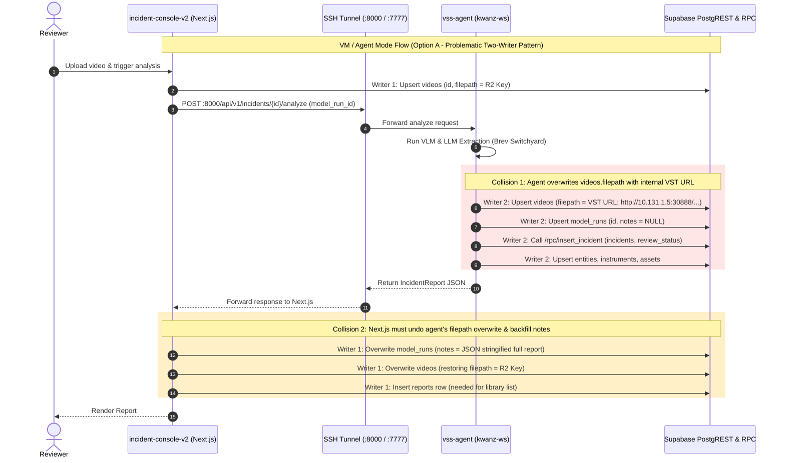
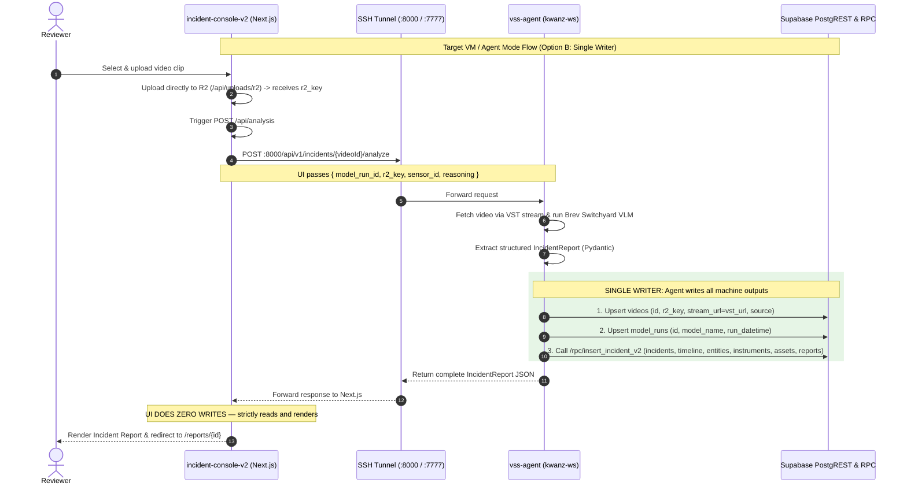

# Option B Architecture Restructure Plan: Supabase Ownership & Schema Modernization

> **PROPOSED — AWAITING CAPTAIN APPROVAL**
> **Date:** 2026-09-25
> **Author:** Crewmate (Worker Agent)
> **Target Release:** Capstone MVP1 Architecture Clean-up / MVP2 Foundation

---

## 1. Executive Summary & Intent

On 2026-09-24, the team decided to pursue **Option B**: restructuring where Supabase persistence lives and establishing a single, unambiguous source of truth for the incident database schema.

### Core Intent
1. **Single Writer for Machine Output:** The **Analyzer** (the backend analysis engine that runs inference) must own all machine output rows (`videos`, `model_runs`, `incidents`, `entities`, `instruments`, `assets`, `incident_timeline`, and report metadata). The **UI** (`incident-console-v2`) must own **only** human review edits (`review_status`, reviewer overrides, `notifications`). In agent mode, the console becomes strictly a consumer of analysis, eliminating the two-writer partial failure hazard and the `videos.filepath` overwrite conflict.
2. **Schema Authority in `supabase/migrations/`:** Move database schema ownership completely out of the retired Streamlit v1 console (`incident-console/db.py`'s `metadata.create_all()`) and into concrete, versioned SQL migrations under `deploy/docker/developer-profiles/dev-profile-incident/supabase/migrations/` as the single authoritative source of truth.
3. **Relational Schema Clean-up:**
   - Elevate `title`, `severity_reason`, `uncertainties`, `location`, and `incident_start_confirmed` from unstructured JSON strings in `model_runs.notes` into first-class SQL columns and child tables (`incident_timeline`).
   - Split `videos.filepath` into a durable Cloudflare R2 object key (`r2_key`) and an internal/replay streaming URL (`stream_url`).
   - Clean up vestigial tables (`queries` and `reports`) and fix schema defects (lack of DB defaults, naive UTC vs timestamptz, float precision truncation).
4. **Unified Daily Operations:** Present `start.sh --mode local` (zero-GPU mock + local gateway) and `start.sh --mode vm` (full blueprint stack on `kwanz-ws` via SSH tunnel) as **the canonical entry points** for the entire workflow across all documentation.

---

## 2. Current State (Option A) Architecture & Problem Analysis

Currently, the system operates under **Option A**, where write responsibilities are fragmented between the client UI and the backend agent.

### 2.1 Write Distribution Matrix (Current State)

| Entity / Table | Local / Gateway Mode (`start.sh --mode local`) | VM / Agent Mode (`start.sh --mode vm`) | Human Review Edits (Both Modes) |
|---|---|---|---|
| `videos` | **Written by Next.js** (`saveVideo` in `route.ts:198-204`): sets `id`, `filepath` (R2 key), `source`, `uploaded_datetime`. | **Double-Written:**<br>1. Next.js inserts R2 key (`route.ts:306`).<br>2. `vss-agent` **overwrites** `filepath` with VST streaming URL (`incident_report_gen.py:392`).<br>3. Next.js **re-overwrites** `filepath` to restore R2 key (`route.ts:430`). | Read-only |
| `model_runs` | **Written by Next.js** (`saveModelRun` in `route.ts:206`): `notes` holds full JSON report. | **Double-Written:**<br>1. `vss-agent` inserts `id` with `notes=NULL` (`incident_report_gen.py:243`).<br>2. Next.js **overwrites** row with `model_name='vss-agent'` and stringified JSON `notes` (`route.ts:428`). | Read-only |
| `incidents` | **Written by Next.js** via `/rpc/insert_incident` (`route.ts:208-218`). | **Written by `vss-agent`** via `/rpc/insert_incident` (`incident_report_gen.py:244-256`). Next.js skips. | **Updated by Next.js** on reviewer edit (`app/api/reports/[videoId]/edit/route.ts`). |
| `entities` | **Written by Next.js** (`route.ts:228-239`, typed `human`). | **Written by `vss-agent`** (`incident_report_gen.py:262-273`, typed `person`, sha256 IDs). Next.js skips. | Read-only |
| `instruments` | **Written by Next.js** (`route.ts:241-255`). | **Written by `vss-agent`** (`incident_report_gen.py:275-286`). Next.js skips. | Read-only |
| `assets` | **Written by Next.js** (`route.ts:257-269`). | **Written by `vss-agent`** (`incident_report_gen.py:288-299`). Next.js skips. | Read-only |
| `reports` | **Written by Next.js** (`saveReport` in `route.ts:271`). | **Written by Next.js** (`saveReport` in `route.ts:432`). `vss-agent` does **not** write this table. | Read-only |
| `review_status` | **Reset by `/rpc/insert_incident`** to `'unreviewed'`. | **Reset by `/rpc/insert_incident`** to `'unreviewed'`. | **Updated by Next.js** (`app/api/reports/[videoId]/review/route.ts`). |
| `notifications` | Not written during analysis. | Not written during analysis. | **Written by Next.js** when reviewer verifies with `severity >= 4`. |
| `queries` | *Unused (0 rows)* | *Unused (0 rows)* | *Unused* |
| `timeline` / `title` / `uncertainties` / `severity_reason` | **Serialized into `model_runs.notes`** JSON by Next.js. | **Serialized into `model_runs.notes`** JSON by Next.js. Dropped from DB by `vss-agent`. | Editable in UI state; partial sync to `incidents.description`. |

### 2.2 Current Sequence Flow & Collision Points (Mermaid)



### 2.3 Key Problems with Option A

1. **Two-Writer Race & Partial-Failure Hazard:**
   - In agent mode, both `vss-agent` and `incident-console-v2` write to `videos` and `model_runs`.
   - If the Next.js process crashes, encounters a network timeout, or drops connection after `vss-agent` finishes, the database is corrupted:
     - `videos.filepath` remains pointed at the unreachable internal VST URL (`http://10.131.1.5:30888/...`).
     - `model_runs.notes` remains `NULL`.
     - `reports` row is never created, making the report invisible in the Next.js Report Library (`/api/reports`).
     - Critical report metadata (`timeline`, `uncertainties`, `title`, `severity_reason`) is completely lost.
2. **The `videos.filepath` Overwrite Bug:**
   - As documented in `status.md` (#3) and verified in `incident_report_gen.py:392`, the agent unconditionally calls `upsert_video(incident_id, filepath=report_result.video_url, source=sensor_id)`.
   - Because `filepath` conflates video storage (R2 key) with stream playback (VST HTTP endpoint), each component overwrites the other's value.
3. **Information Loss and JSON Dumping in `model_runs.notes`:**
   - Standard relational tables only capture 7 basic incident attributes (`type`, `start_timestamp`, `end_timestamp`, `duration`, `description`, `severity_level`, `confidence_score`).
   - Rich structured intelligence extracted by state-of-the-art VLMs (`title`, `severity_reason`, `timeline`, `uncertainties`, `location`, `incident_start_confirmed`) has no SQL destination.
   - Stashing the entire report in `model_runs.notes` as stringified JSON prevents indexing, relational queries, structured filtering, and direct PostgREST operations.
4. **Zombie Schema Definition in Retired Code:**
   - The authoritative DDL still resides in `incident-console/db.py` (the deprecated Streamlit UI dropped on 2026-09-24).
   - `supabase/migrations/` contains only `20260917141225_insert_incident_function.sql`. A clean environment cannot bootstrap the database without running dead code.
5. **Redundant & Vestigial Tables:**
   - `queries`: 0 rows live; unused by all active code.
   - `reports`: Merely a duplicate tuple `(id, incident_id, model_run_id, filepath, generated_datetime)`. Because 1 video = 1 incident (`incident_id == video_id`), this table duplicates the `(incident_id, model_run_id)` composite key of `incidents`.
6. **Data Type and Default Quirks:**
   - Live database inspection revealed that column defaults (`uploaded_datetime`, `status='unreviewed'`, `acknowledged=false`) were only defined client-side in SQLAlchemy, leading to 58 NULL rows in `videos.uploaded_datetime`.
   - `p_confidence_score` in `/rpc/insert_incident` is `REAL` (float4), whereas `incidents.confidence_score` is `FLOAT` (float8 / double precision), causing precision degradation (e.g. `0.85` becomes `0.8500000238...`).
   - Entity type divergence: agent writes `type="person"` while console writes `type="human"`.

---

## 3. Option B Target Architecture

Option B establishes a clean boundary:
- **The Analyzer owns all machine output.**
- **The UI owns only human review edits and UI state.**
- **The Database schema is versioned, normalized, and self-contained in Supabase.**

### 3.1 Design Principles (Easiest Implementation, Fewest Moving Parts)

1. **Strict Single-Writer per Mode:**
   - In **VM / Agent Mode (`--mode vm`)**: `vss-agent` performs 100% of machine persistence. Next.js passes the R2 key (`r2_key`) and sensor ID to the agent in the request body. When the agent finishes, it writes all tables (including the `reports` row and normalized timeline) in a single atomic transaction. Next.js receives the report, writes **nothing**, and immediately displays it.
   - In **Local / Gateway Mode (`--mode local`)**: There is no agent daemon. Next.js (`analyzeViaGateway` in `route.ts`) acts as the analyzer orchestrator, calling the exact same Supabase PostgREST endpoints and RPC functions with the exact same data payload.
2. **Split Storage Keys from Stream URLs:**
   - `videos.r2_key`: Dedicated column for the Cloudflare R2 object key (e.g. `uploads/<sensorId>/<uuid>.mp4`).
   - `videos.stream_url`: Dedicated column for the VST/internal streaming URL (e.g. `http://10.131.1.5:30888/...`).
   - Retain `videos.filepath` as a backward-compatible alias or view column during transition.
3. **First-Class Columns and Timeline Table:**
   - Expand `incidents` with native columns: `title`, `severity_reason`, `uncertainties` (`TEXT[]` or `JSONB`), `location`, `incident_start_confirmed`.
   - Create `incident_timeline` table to store discrete chronological events (`start_seconds`, `end_seconds`, `description`).
4. **Keep MVP1 Footprint Intact:**
   - Maintain the `(incident_id, model_run_id)` primary key identity so existing evaluation scripts (`eval/`) and review UI continue functioning without massive rewrites.

### 3.2 Where the Supabase Connector Lives

```
+-------------------------------------------------------------------------------+
| LOCAL / GATEWAY MODE (start.sh --mode local)                                  |
|                                                                               |
|   +-----------------------+           +------------------+                    |
|   |  incident-console-v2  |           |   vlm-gateway    |                    |
|   |  (Next.js App Router) | --------> |  (FastAPI :8600) |                    |
|   |                       |           +------------------+                    |
|   |   [PostgrestClient]   |                                                   |
|   +-----------+-----------+                                                   |
|               | (HTTPS PostgREST & RPC)                                       |
|               v                                                               |
|   +-----------------------+                                                   |
|   |  Supabase PostgreSQL  | <--- Single Writer in Local Mode: Next.js API     |
|   +-----------------------+                                                   |
+-------------------------------------------------------------------------------+

+-------------------------------------------------------------------------------+
| VM / AGENT MODE (start.sh --mode vm)                                          |
|                                                                               |
|   +-----------------------+      SSH Tunnel      +------------------------+   |
|   |  incident-console-v2  | -------------------> |       vss-agent        |   |
|   |  (Next.js App Router) |  POST /analyze       |     (Native :8000)     |   |
|   |                       |  (passes r2_key)     |                        |   |
|   |  [PostgrestClient]    |                      |     [IncidentDB]       |   |
|   +-----------+-----------+                      +-----------+------------+   |
|               |                                              |                |
|               | (Review & Human Edits Only)                  | (ALL Machine   |
|               |                                              |  Output Rows)  |
|               v                                              v                |
|   +---------------------------------------------------------------+           |
|   |                      Supabase PostgreSQL                      |           |
|   +---------------------------------------------------------------+           |
+-------------------------------------------------------------------------------+
```

### 3.3 Option B Sequence Flow (Target State)



---

## 4. Proposed Schema (Concrete Migration-Ready DDL)

> **PROPOSED — AWAITING CAPTAIN APPROVAL**
> The following SQL DDL represents the complete target schema to be placed under `deploy/docker/developer-profiles/dev-profile-incident/supabase/migrations/`.

### 4.1 Schema Evolution Summary (What Changes vs. Today)

| Table | What Changes in Option B | Rationale |
|---|---|---|
| `videos` | • Split `filepath` into `r2_key VARCHAR(1024)` and `stream_url VARCHAR(1024)`.<br>• Keep `filepath` as a generated column: `COALESCE(r2_key, stream_url)`.<br>• Add `DEFAULT (now() AT TIME ZONE 'utc')` to `uploaded_datetime`. | Eliminates the R2 vs. VST URL overwrite bug. Fixes NULL uploaded dates. |
| `model_runs` | • Add `DEFAULT (now() AT TIME ZONE 'utc')` to `run_datetime`.<br>• Change `notes` to optional unstructured debug note, NOT required for report rendering. | Structured data now lives in first-class columns. |
| `incidents` | • Add `title VARCHAR(255)` (max 160 chars per UI spec).<br>• Add `severity_reason TEXT`.<br>• Add `uncertainties TEXT[]` (Postgres array of strings).<br>• Add `location VARCHAR(255)`.<br>• Add `incident_start_confirmed BOOLEAN DEFAULT FALSE`. | Eliminates loss of VLM intelligence and removes dependency on `notes` JSON. |
| `incident_timeline` | **NEW TABLE**:<br>• `incident_id VARCHAR(20)`, `model_run_id VARCHAR(20)`, `event_index INT`.<br>• `start_seconds REAL NOT NULL`, `end_seconds REAL`, `description TEXT NOT NULL`.<br>• Composite FK -> `incidents(incident_id, model_run_id) ON DELETE CASCADE`. | First-class storage for chronological event timeline. |
| `entities` | • Standardize `type VARCHAR(16)` CHECK constraint to allow `'human'`, `'animal'`, `'person'`, `'unknown'`. | Accommodates both agent (`person`) and UI (`human`) without silent coercion failures. |
| `reports` | • Generated automatically by the Analyzer during analysis.<br>• Retained for backward compatibility with Report Library queries.<br>• Marked for eventual replacement by `incidents_summary_view`. | Keeps Next.js library queries fast while avoiding broken references. |
| `queries` | • Kept in schema as reserved table for MVP2 Natural Language Search, but `reports.query_id` is made fully optional and decoupled. | Preserves future search roadmap without blocking MVP1 clean-up. |
| `insert_incident` (RPC) | • Renamed to `insert_incident_v2` (or updated in-place) to accept `title`, `severity_reason`, `uncertainties`, `location`, `incident_start_confirmed`, and JSON arrays for timeline and evidence in a single atomic transaction. | Atomic server-side write of the complete incident report. |
| Legacy Tables | • Formally drop 4 orphaned tables: `incident_reports`, `incident_entities`, `incident_instruments`, `incident_assets`. | Clean up dead schema from before 2026-09-17. |

---

### 4.2 Migration Script 1: `20260925100000_option_b_core_schema.sql`

```sql
-- SPDX-License-Identifier: Apache-2.0
-- Migration: Option B Core Schema Migration
-- PROPOSED - AWAITING CAPTAIN APPROVAL

-- 1. Shared Reference Tables
CREATE TABLE IF NOT EXISTS videos (
    id VARCHAR(20) PRIMARY KEY,
    r2_key VARCHAR(1024),
    stream_url VARCHAR(1024),
    filepath VARCHAR(1024) GENERATED ALWAYS AS (COALESCE(r2_key, stream_url)) STORED,
    uploaded_datetime TIMESTAMP WITHOUT TIME ZONE DEFAULT (now() AT TIME ZONE 'utc'),
    duration INTEGER,
    source VARCHAR(512)
);

CREATE TABLE IF NOT EXISTS queries (
    id VARCHAR(20) PRIMARY KEY,
    query_text TEXT NOT NULL,
    submitted_datetime TIMESTAMP WITHOUT TIME ZONE DEFAULT (now() AT TIME ZONE 'utc')
);

CREATE TABLE IF NOT EXISTS model_runs (
    id VARCHAR(20) PRIMARY KEY,
    model_name VARCHAR(128) NOT NULL,
    model_version VARCHAR(128),
    prompt_version VARCHAR(64),
    run_datetime TIMESTAMP WITHOUT TIME ZONE DEFAULT (now() AT TIME ZONE 'utc'),
    notes TEXT
);

-- 2. Core Incidents Table (With First-Class Intelligence Columns)
CREATE TABLE IF NOT EXISTS incidents (
    incident_id VARCHAR(20) NOT NULL,
    model_run_id VARCHAR(20) NOT NULL,
    title VARCHAR(255) DEFAULT 'Incident Report',
    type VARCHAR(32),
    start_timestamp VARCHAR(32),
    end_timestamp VARCHAR(32),
    duration INTEGER,
    description TEXT,
    severity_level INTEGER CHECK (severity_level BETWEEN 1 AND 5),
    severity_reason TEXT,
    confidence_score DOUBLE PRECISION CHECK (confidence_score BETWEEN 0.0 AND 1.0),
    uncertainties TEXT[] DEFAULT '{}',
    location VARCHAR(255) DEFAULT '',
    incident_start_confirmed BOOLEAN DEFAULT FALSE,
    PRIMARY KEY (incident_id, model_run_id),
    CONSTRAINT fk_incidents_video FOREIGN KEY (incident_id) REFERENCES videos(id) ON DELETE CASCADE,
    CONSTRAINT fk_incidents_model_run FOREIGN KEY (model_run_id) REFERENCES model_runs(id) ON DELETE CASCADE
);

-- 3. Reports Reference Table
CREATE TABLE IF NOT EXISTS reports (
    id VARCHAR(20) PRIMARY KEY,
    incident_id VARCHAR(20) NOT NULL,
    query_id VARCHAR(20),
    model_run_id VARCHAR(20) NOT NULL,
    filepath VARCHAR(1024),
    generated_datetime TIMESTAMP WITHOUT TIME ZONE DEFAULT (now() AT TIME ZONE 'utc'),
    CONSTRAINT fk_reports_query FOREIGN KEY (query_id) REFERENCES queries(id) ON DELETE SET NULL,
    CONSTRAINT fk_reports_incident FOREIGN KEY (incident_id, model_run_id)
        REFERENCES incidents(incident_id, model_run_id) ON DELETE CASCADE
);

-- 4. First-Class Incident Timeline Table
CREATE TABLE IF NOT EXISTS incident_timeline (
    id BIGSERIAL PRIMARY KEY,
    incident_id VARCHAR(20) NOT NULL,
    model_run_id VARCHAR(20) NOT NULL,
    event_index INTEGER NOT NULL,
    start_seconds REAL NOT NULL DEFAULT 0.0,
    end_seconds REAL,
    description TEXT NOT NULL,
    CONSTRAINT fk_timeline_incident FOREIGN KEY (incident_id, model_run_id)
        REFERENCES incidents(incident_id, model_run_id) ON DELETE CASCADE,
    CONSTRAINT uq_timeline_event UNIQUE (incident_id, model_run_id, event_index)
);

-- 5. Evidence Tables (Entities, Instruments, Assets)
CREATE TABLE IF NOT EXISTS entities (
    incident_id VARCHAR(20) NOT NULL,
    entity_id VARCHAR(20) NOT NULL,
    model_run_id VARCHAR(20) NOT NULL,
    type VARCHAR(16) DEFAULT 'unknown',
    description TEXT,
    image VARCHAR(1024),
    PRIMARY KEY (incident_id, entity_id, model_run_id),
    CONSTRAINT fk_entities_incident FOREIGN KEY (incident_id, model_run_id)
        REFERENCES incidents(incident_id, model_run_id) ON DELETE CASCADE
);

CREATE TABLE IF NOT EXISTS instruments (
    incident_id VARCHAR(20) NOT NULL,
    instrument_id VARCHAR(20) NOT NULL,
    model_run_id VARCHAR(20) NOT NULL,
    entity_id VARCHAR(20),
    name VARCHAR(256),
    description TEXT,
    threat_level INTEGER CHECK (threat_level IS NULL OR (threat_level BETWEEN 1 AND 5)),
    image VARCHAR(1024),
    PRIMARY KEY (incident_id, instrument_id, model_run_id),
    CONSTRAINT fk_instruments_incident FOREIGN KEY (incident_id, model_run_id)
        REFERENCES incidents(incident_id, model_run_id) ON DELETE CASCADE
);

CREATE TABLE IF NOT EXISTS assets (
    incident_id VARCHAR(20) NOT NULL,
    asset_id VARCHAR(20) NOT NULL,
    model_run_id VARCHAR(20) NOT NULL,
    name VARCHAR(256),
    description TEXT,
    image VARCHAR(1024),
    PRIMARY KEY (incident_id, asset_id, model_run_id),
    CONSTRAINT fk_assets_incident FOREIGN KEY (incident_id, model_run_id)
        REFERENCES incidents(incident_id, model_run_id) ON DELETE CASCADE
);

-- 6. Review & Operational Workflow Tables
CREATE TABLE IF NOT EXISTS review_status (
    incident_id VARCHAR(20) NOT NULL,
    model_run_id VARCHAR(20) NOT NULL,
    status VARCHAR(32) NOT NULL DEFAULT 'unreviewed' CHECK (status IN ('unreviewed', 'under review', 'verified')),
    verified_by VARCHAR(256),
    verified_at TIMESTAMP WITHOUT TIME ZONE,
    edited_by VARCHAR(256),
    edited_at TIMESTAMP WITHOUT TIME ZONE,
    PRIMARY KEY (incident_id, model_run_id),
    CONSTRAINT fk_review_incident FOREIGN KEY (incident_id, model_run_id)
        REFERENCES incidents(incident_id, model_run_id) ON DELETE CASCADE
);

CREATE TABLE IF NOT EXISTS notifications (
    id SERIAL PRIMARY KEY,
    incident_id VARCHAR(20) NOT NULL,
    model_run_id VARCHAR(20) NOT NULL,
    severity INTEGER,
    created_at TIMESTAMP WITHOUT TIME ZONE DEFAULT (now() AT TIME ZONE 'utc'),
    acknowledged BOOLEAN NOT NULL DEFAULT FALSE,
    CONSTRAINT fk_notifications_incident FOREIGN KEY (incident_id, model_run_id)
        REFERENCES incidents(incident_id, model_run_id) ON DELETE CASCADE
);

CREATE TABLE IF NOT EXISTS severity_eval_log (
    id SERIAL PRIMARY KEY,
    incident_id VARCHAR(20) NOT NULL,
    model_run_id VARCHAR(20) NOT NULL,
    ai_severity INTEGER,
    human_severity INTEGER,
    rater VARCHAR(256),
    rated_at TIMESTAMP WITHOUT TIME ZONE DEFAULT (now() AT TIME ZONE 'utc'),
    CONSTRAINT fk_severity_log_incident FOREIGN KEY (incident_id, model_run_id)
        REFERENCES incidents(incident_id, model_run_id) ON DELETE CASCADE
);

-- 7. Ground Truth & Matching Tables
CREATE TABLE IF NOT EXISTS gt_incidents (
    incident_id VARCHAR(20) PRIMARY KEY,
    type VARCHAR(32),
    start_timestamp VARCHAR(32),
    end_timestamp VARCHAR(32),
    duration INTEGER,
    description TEXT,
    severity_level INTEGER,
    labelled_by VARCHAR(256),
    labelled_datetime TIMESTAMP WITHOUT TIME ZONE,
    CONSTRAINT fk_gt_incidents_video FOREIGN KEY (incident_id) REFERENCES videos(id) ON DELETE CASCADE
);

CREATE TABLE IF NOT EXISTS gt_entities (
    incident_id VARCHAR(20) NOT NULL,
    entity_id VARCHAR(20) NOT NULL,
    type VARCHAR(16),
    description TEXT,
    image VARCHAR(1024),
    PRIMARY KEY (incident_id, entity_id),
    CONSTRAINT fk_gt_entities_incident FOREIGN KEY (incident_id) REFERENCES gt_incidents(incident_id) ON DELETE CASCADE
);

CREATE TABLE IF NOT EXISTS gt_instruments (
    incident_id VARCHAR(20) NOT NULL,
    instrument_id VARCHAR(20) NOT NULL,
    entity_id VARCHAR(20),
    name VARCHAR(256),
    description TEXT,
    threat_level INTEGER,
    image VARCHAR(1024),
    PRIMARY KEY (incident_id, instrument_id),
    CONSTRAINT fk_gt_instruments_incident FOREIGN KEY (incident_id) REFERENCES gt_incidents(incident_id) ON DELETE CASCADE
);

CREATE TABLE IF NOT EXISTS gt_assets (
    incident_id VARCHAR(20) NOT NULL,
    asset_id VARCHAR(20) NOT NULL,
    name VARCHAR(256),
    description TEXT,
    image VARCHAR(1024),
    PRIMARY KEY (incident_id, asset_id),
    CONSTRAINT fk_gt_assets_incident FOREIGN KEY (incident_id) REFERENCES gt_incidents(incident_id) ON DELETE CASCADE
);

CREATE TABLE IF NOT EXISTS entity_matches (
    incident_id VARCHAR(20) NOT NULL,
    model_run_id VARCHAR(20) NOT NULL,
    entity_id VARCHAR(20) NOT NULL,
    gt_entity_id VARCHAR(20) NOT NULL,
    similarity_score FLOAT NOT NULL,
    matched_at TIMESTAMP WITHOUT TIME ZONE DEFAULT (now() AT TIME ZONE 'utc'),
    PRIMARY KEY (incident_id, model_run_id, entity_id),
    CONSTRAINT fk_entity_matches_entity FOREIGN KEY (incident_id, entity_id, model_run_id)
        REFERENCES entities(incident_id, entity_id, model_run_id) ON DELETE CASCADE,
    CONSTRAINT fk_entity_matches_gt FOREIGN KEY (incident_id, gt_entity_id)
        REFERENCES gt_entities(incident_id, entity_id) ON DELETE CASCADE
);

CREATE TABLE IF NOT EXISTS instrument_matches (
    incident_id VARCHAR(20) NOT NULL,
    model_run_id VARCHAR(20) NOT NULL,
    instrument_id VARCHAR(20) NOT NULL,
    gt_instrument_id VARCHAR(20) NOT NULL,
    similarity_score FLOAT NOT NULL,
    matched_at TIMESTAMP WITHOUT TIME ZONE DEFAULT (now() AT TIME ZONE 'utc'),
    PRIMARY KEY (incident_id, model_run_id, instrument_id),
    CONSTRAINT fk_instrument_matches_inst FOREIGN KEY (incident_id, instrument_id, model_run_id)
        REFERENCES instruments(incident_id, instrument_id, model_run_id) ON DELETE CASCADE,
    CONSTRAINT fk_instrument_matches_gt FOREIGN KEY (incident_id, gt_instrument_id)
        REFERENCES gt_instruments(incident_id, instrument_id) ON DELETE CASCADE
);

CREATE TABLE IF NOT EXISTS asset_matches (
    incident_id VARCHAR(20) NOT NULL,
    model_run_id VARCHAR(20) NOT NULL,
    asset_id VARCHAR(20) NOT NULL,
    gt_asset_id VARCHAR(20) NOT NULL,
    similarity_score FLOAT NOT NULL,
    matched_at TIMESTAMP WITHOUT TIME ZONE DEFAULT (now() AT TIME ZONE 'utc'),
    PRIMARY KEY (incident_id, model_run_id, asset_id),
    CONSTRAINT fk_asset_matches_asset FOREIGN KEY (incident_id, asset_id, model_run_id)
        REFERENCES assets(incident_id, asset_id, model_run_id) ON DELETE CASCADE,
    CONSTRAINT fk_asset_matches_gt FOREIGN KEY (incident_id, gt_asset_id)
        REFERENCES gt_assets(incident_id, asset_id) ON DELETE CASCADE
);

-- Indices for performance
CREATE INDEX IF NOT EXISTS idx_incidents_model_run ON incidents(model_run_id);
CREATE INDEX IF NOT EXISTS idx_timeline_lookup ON incident_timeline(incident_id, model_run_id);
CREATE INDEX IF NOT EXISTS idx_review_status_lookup ON review_status(status);
```

---

### 4.3 Migration Script 2: `20260925100001_atomic_insert_incident_rpc_v2.sql`

```sql
-- SPDX-License-Identifier: Apache-2.0
-- Migration: Atomic Insert Incident RPC Function (Version 2)
-- PROPOSED - AWAITING CAPTAIN APPROVAL

CREATE OR REPLACE FUNCTION insert_incident_v2(
    p_incident_id TEXT,
    p_model_run_id TEXT,
    p_title TEXT DEFAULT 'Incident Report',
    p_type TEXT DEFAULT 'other',
    p_start_timestamp TEXT DEFAULT NULL,
    p_end_timestamp TEXT DEFAULT NULL,
    p_duration INTEGER DEFAULT NULL,
    p_description TEXT DEFAULT NULL,
    p_severity_level INTEGER DEFAULT 1,
    p_severity_reason TEXT DEFAULT '',
    p_confidence_score DOUBLE PRECISION DEFAULT 0.0,
    p_uncertainties TEXT[] DEFAULT '{}',
    p_location TEXT DEFAULT '',
    p_incident_start_confirmed BOOLEAN DEFAULT FALSE,
    p_timeline JSONB DEFAULT '[]'::jsonb,
    p_entities JSONB DEFAULT '[]'::jsonb,
    p_instruments JSONB DEFAULT '[]'::jsonb,
    p_assets JSONB DEFAULT '[]'::jsonb
) RETURNS VOID
LANGUAGE plpgsql
SECURITY INVOKER
AS $$
DECLARE
    elem JSONB;
    idx INTEGER := 0;
BEGIN
    -- 1. Atomically replace incident row
    DELETE FROM incidents
    WHERE incident_id = p_incident_id AND model_run_id = p_model_run_id;

    INSERT INTO incidents (
        incident_id, model_run_id, title, type, start_timestamp, end_timestamp,
        duration, description, severity_level, severity_reason, confidence_score,
        uncertainties, location, incident_start_confirmed
    ) VALUES (
        p_incident_id, p_model_run_id, p_title, p_type, p_start_timestamp, p_end_timestamp,
        p_duration, p_description, p_severity_level, p_severity_reason, p_confidence_score,
        p_uncertainties, p_location, p_incident_start_confirmed
    );

    -- 2. Atomically reset review status to 'unreviewed'
    DELETE FROM review_status
    WHERE incident_id = p_incident_id AND model_run_id = p_model_run_id;

    INSERT INTO review_status (incident_id, model_run_id, status)
    VALUES (p_incident_id, p_model_run_id, 'unreviewed');

    -- 3. Replace timeline items
    DELETE FROM incident_timeline
    WHERE incident_id = p_incident_id AND model_run_id = p_model_run_id;

    IF jsonb_array_length(p_timeline) > 0 THEN
        idx := 0;
        FOR elem IN SELECT * FROM jsonb_array_elements(p_timeline) LOOP
            INSERT INTO incident_timeline (
                incident_id, model_run_id, event_index, start_seconds, end_seconds, description
            ) VALUES (
                p_incident_id,
                p_model_run_id,
                idx,
                COALESCE((elem->>'start_seconds')::real, (elem->>'startSeconds')::real, 0.0),
                COALESCE((elem->>'end_seconds')::real, (elem->>'endSeconds')::real, NULL),
                COALESCE(elem->>'description', '')
            );
            idx := idx + 1;
        END LOOP;
    END IF;

    -- 4. Replace entities
    DELETE FROM entities
    WHERE incident_id = p_incident_id AND model_run_id = p_model_run_id;

    IF jsonb_array_length(p_entities) > 0 THEN
        FOR elem IN SELECT * FROM jsonb_array_elements(p_entities) LOOP
            INSERT INTO entities (
                incident_id, entity_id, model_run_id, type, description, image
            ) VALUES (
                p_incident_id,
                elem->>'entity_id',
                p_model_run_id,
                COALESCE(elem->>'type', 'unknown'),
                elem->>'description',
                elem->>'image'
            );
        END LOOP;
    END IF;

    -- 5. Replace instruments
    DELETE FROM instruments
    WHERE incident_id = p_incident_id AND model_run_id = p_model_run_id;

    IF jsonb_array_length(p_instruments) > 0 THEN
        FOR elem IN SELECT * FROM jsonb_array_elements(p_instruments) LOOP
            INSERT INTO instruments (
                incident_id, instrument_id, model_run_id, entity_id, name, description, threat_level, image
            ) VALUES (
                p_incident_id,
                elem->>'instrument_id',
                p_model_run_id,
                elem->>'entity_id',
                elem->>'name',
                elem->>'description',
                (elem->>'threat_level')::integer,
                elem->>'image'
            );
        END LOOP;
    END IF;

    -- 6. Replace assets
    DELETE FROM assets
    WHERE incident_id = p_incident_id AND model_run_id = p_model_run_id;

    IF jsonb_array_length(p_assets) > 0 THEN
        FOR elem IN SELECT * FROM jsonb_array_elements(p_assets) LOOP
            INSERT INTO assets (
                incident_id, asset_id, model_run_id, name, description, image
            ) VALUES (
                p_incident_id,
                elem->>'asset_id',
                p_model_run_id,
                elem->>'name',
                elem->>'description',
                elem->>'image'
            );
        END LOOP;
    END IF;

    -- 7. Ensure a reports table row exists for UI library queries
    INSERT INTO reports (
        id, incident_id, model_run_id, query_id, filepath, generated_datetime
    ) VALUES (
        'r' || substring(md5(p_incident_id || ':' || p_model_run_id) from 1 for 19),
        p_incident_id,
        p_model_run_id,
        NULL,
        NULL,
        (now() AT TIME ZONE 'utc')
    )
    ON CONFLICT (id) DO UPDATE SET
        generated_datetime = (now() AT TIME ZONE 'utc');

END;
$$;

-- Grant permissions for PostgREST
GRANT EXECUTE ON FUNCTION insert_incident_v2 TO anon, authenticated, service_role;
```

---

### 4.4 Migration Script 3: `20260925100002_drop_legacy_tables.sql`

```sql
-- SPDX-License-Identifier: Apache-2.0
-- Migration: Drop Legacy Orphaned Incident Tables (Pre-2026-09-17)
-- PROPOSED - AWAITING CAPTAIN APPROVAL

-- These 4 tables are leftovers from an obsolete integer report-id schema.
-- Confirmed 0 references across the entire codebase.
DROP TABLE IF EXISTS incident_assets CASCADE;
DROP TABLE IF EXISTS incident_instruments CASCADE;
DROP TABLE IF EXISTS incident_entities CASCADE;
DROP TABLE IF EXISTS incident_reports CASCADE;
```

---

## 5. Phased Implementation Order (Easiest Path First)

To minimize disruption, the implementation must follow four strictly ordered phases. Each phase is independently testable.

```
+-----------------------------------------------------------------------------------+
| Phase 1: Database Migration & Schema Alignment (Additive, Zero Code Changes)     |
|   • Apply migrations 20260925100000, 20260925100001, and 20260925100002.        |
|   • Existing code continues to work without interruption (backward-compatible).  |
+-----------------------------------------------------------------------------------+
                                         |
                                         v
+-----------------------------------------------------------------------------------+
| Phase 2: Agent PostgREST Client & Analyzer Update (vss-agent)                     |
|   • Update incident_analyze.py to accept r2_key in request body.                  |
|   • Update incident_report_gen.py to persist r2_key, stream_url, title, timeline. |
|   • Switch persistence to insert_incident_v2 RPC in incident_db.py.               |
|   • Agent now writes ALL machine tables in one atomic RPC call.                   |
+-----------------------------------------------------------------------------------+
                                         |
                                         v
+-----------------------------------------------------------------------------------+
| Phase 3: Incident Console v2 Streamlining (incident-console-v2)                   |
|   • Remove ALL database write calls from analyzeViaAgent in route.ts.             |
|   • Pass r2_key in request body to agent endpoint.                                |
|   • Update analyzeViaGateway to use insert_incident_v2 RPC and new columns.       |
|   • Update reports/[videoId]/route.ts to read directly from SQL columns/timeline. |
+-----------------------------------------------------------------------------------+
                                         |
                                         v
+-----------------------------------------------------------------------------------+
| Phase 4: Deprecate incident-console/db.py & Finalize Docs                         |
|   • Mark incident-console/db.py as ARCHIVED / DEPRECATED.                         |
|   • Point all architecture and operational documentation to supabase/migrations.  |
+-----------------------------------------------------------------------------------+
```

### Phase 1: Database Migration & Schema Alignment
- **Action:** Apply the three SQL migration files via Supabase CLI (`supabase db push`) or Supabase Dashboard.
- **Why it's safe:** All schema changes are **purely additive** (new columns on `videos` and `incidents`, new table `incident_timeline`, new RPC `insert_incident_v2`). The existing `insert_incident` function and existing columns remain functional during this phase.

### Phase 2: Agent PostgREST Client & Analyzer Update (`services/agent/`)
- **Action:**
  1. In `services/agent/src/vss_agents/api/incident_analyze.py`:
     - Add `r2_key: str | None = None` to `AnalyzeIncidentRequest`.
     - Pass `r2_key` into `tool_input`.
  2. In `services/agent/src/vss_agents/tools/incident_report_gen.py`:
     - Accept `r2_key` in `IncidentReportGenInput`.
     - In `_persist_incident`:
       - Store `r2_key` in `videos.r2_key`.
       - Store `report_result.video_url` in `videos.stream_url`.
       - Call `insert_incident_v2` passing `title`, `severity_reason`, `uncertainties`, `location`, `timeline`, and evidence arrays.
  3. In `services/agent/src/vss_agents/utils/incident_db.py`:
     - Update `upsert_video` to accept `r2_key` and `stream_url`.
     - Add `insert_incident_v2` RPC call.
     - Add `get_incident_timeline` read method.
- **Verification:** Run a test analysis on `kwanz-ws`. Confirm that `videos.r2_key` is populated and not overwritten by `stream_url`, and that `incident_timeline` rows are created.

### Phase 3: Incident Console v2 Streamlining (`incident-console-v2/`)
- **Action:**
  1. In `incident-console-v2/app/api/analysis/route.ts`:
     - **In `analyzeViaAgent`:** Delete `saveVideo`, delete `saveModelRun`, delete `saveReport`, and delete the `restoring the video R2 key` block!
     - In the request body to the agent, pass `r2_key: input.filepath`.
     - Simply parse the returned `IncidentReport` and return it to the caller.
     - **In `analyzeViaGateway`:** Call `insert_incident_v2` RPC to persist all structured fields atomically.
  2. In `incident-console-v2/app/api/reports/[videoId]/route.ts`:
     - Fetch `incident_timeline` rows directly rather than falling back to empty array.
     - Read `title`, `severity_reason`, `uncertainties` directly from the `incidents` row.
     - Retain `reportFromNotes` only as a secondary fallback for older model runs.
- **Verification:** Run `start.sh --mode local` and `start.sh --mode vm`. Verify that video uploads and analyses complete with zero double-writes and zero filepath overwrites.

### Phase 4: Deprecate `incident-console/db.py` & Finalize Docs
- **Action:**
  - Add deprecation banner to `incident-console/db.py`.
  - Update `data.md` and `architecture.md` to reflect `supabase/migrations/` as the single authoritative DDL source.

---

## 6. Risks & Mitigation Strategies

| Risk | Impact | Mitigation Strategy |
|---|---|---|
| **VM Site-Packages Drift (Non-Editable Package)** | Code changes under `services/agent/src/` fail to take effect on `kwanz-ws` because `.venv` has a stale static install (as identified in `vss-validate-architecture/report.md` L2/L5). | Run `uv sync` in `/srv/rise-up/vss/services/agent` on `kwanz-ws` to establish an editable install (`editable: true`) before deploying Phase 2 changes. |
| **Outbound Port 5432 DPI Blocking** | Direct Postgres connections (`psycopg2` / `asyncpg`) from `kwanz-ws` are dropped by the campus firewall. | Keep `vss-agent` strictly on HTTPS PostgREST / RPC via `INCIDENT_SUPABASE_URL` and `INCIDENT_SUPABASE_SERVICE_ROLE_KEY`. Never introduce direct SQL drivers into the agent. |
| **Evaluation Pipeline Breakage (`eval/`)** | Standalone benchmark scripts in `eval/` expect specific database columns or types. | All schema modifications are backward-compatible. `incidents.incident_id`, `incidents.model_run_id`, and `gt_*` tables maintain exact column definitions, types, and composite keys. |
| **Live Database Migration Interruption** | Applying DDL to the live Supabase instance could lock tables or fail if active connections exist. | Migrations use `CREATE TABLE IF NOT EXISTS`, `ALTER TABLE ... ADD COLUMN IF NOT EXISTS`, and `CREATE OR REPLACE FUNCTION`. Zero table rewrites or locks on existing high-traffic tables. |
| **Old Model Runs Missing New Columns** | Historical records in `incidents` will have NULL `title` or empty `uncertainties`. | Next.js API routes implement safe fallbacks (e.g. `COALESCE(title, type || ' report')`) and check `model_runs.notes` for pre-Option-B rows. |

---

## 7. Verification and Testing Plan

### 7.1 Automated & Unit Verification
1. **Pydantic Model & Schema Validation:**
   - Run `pytest services/agent/tests/` to verify `IncidentReport` serialization and deserialization.
   - Run `npm run lint` and `npm run build` in `incident-console-v2` to verify TypeScript/Zod alignment.
2. **PostgREST RPC Verification:**
   - Execute a test call against `/rpc/insert_incident_v2` with sample JSON payload. Confirm atomic creation of `incidents`, `review_status`, `incident_timeline`, `entities`, `instruments`, `assets`, and `reports`.

### 7.2 End-to-End Operational Testing

#### Test Case 1: Local / Gateway Mode (`start.sh --mode local`)
1. Run `./start.sh --mode local` from laptop.
2. Open `http://localhost:3200`.
3. Upload clip `Animal1_x264.mp4`.
4. Trigger analysis.
5. **Verify:**
   - Video is stored in R2.
   - PostgREST shows `videos.r2_key` matches R2 key.
   - `incidents` contains `title`, `severity_reason`, `uncertainties`.
   - `incident_timeline` has discrete rows with `start_seconds` and `end_seconds`.
   - Report displays accurately in UI with timeline cards and uncertainties.

#### Test Case 2: VM / Agent Mode (`start.sh --mode vm`)
1. Run `./start.sh --mode vm` from laptop.
2. Confirm SSH tunnel brings up `localhost:8000` and `localhost:7777`.
3. Upload clip `Burglary012_x264.mp4`.
4. Trigger analysis.
5. **Verify:**
   - Browser network tab shows only **one** analyze POST to `/api/analysis`.
   - Next.js server logs show **zero** write queries during `analyzeViaAgent`.
   - Database check:
     - `videos.r2_key` contains the Cloudflare R2 key.
     - `videos.stream_url` contains the internal VST stream URL.
     - `videos.filepath` reflects the R2 key.
     - `reports` row exists with matching `(incident_id, model_run_id)`.
     - `incident_timeline` contains extracted chronological events.
   - Report renders immediately without requiring page refresh.

#### Test Case 3: Review Workflow
1. Navigate to `/reports/<id>`.
2. Transition review status: `unreviewed` -> `verified`.
3. If severity >= 4, verify that a row is added to `notifications`.
4. Edit incident description. Confirm `review_status.edited_by` and `edited_at` update while `videos.r2_key` remains untouched.

---

## 8. Summary Table: Files to be Modified during Restructure

| Component | Target File | Planned Changes |
|---|---|---|
| **Supabase** | `supabase/migrations/20260925100000_option_b_core_schema.sql` | Baseline DDL for all 18 tables + `incident_timeline` + split video keys. |
| **Supabase** | `supabase/migrations/20260925100001_atomic_insert_incident_rpc_v2.sql` | Atomic RPC procedure handling all machine tables. |
| **Supabase** | `supabase/migrations/20260925100002_drop_legacy_tables.sql` | Drop 4 dead legacy tables. |
| **Agent** | `services/agent/src/vss_agents/api/incident_analyze.py` | Accept `r2_key` in request body; forward to report tool. |
| **Agent** | `services/agent/src/vss_agents/tools/incident_report_gen.py` | Persist `r2_key` and `stream_url` without overwrite; invoke `insert_incident_v2`. |
| **Agent** | `services/agent/src/vss_agents/utils/incident_db.py` | Add `insert_incident_v2` RPC call and timeline persistence. |
| **Console v2** | `incident-console-v2/app/api/analysis/route.ts` | Drop all DB writes in `analyzeViaAgent`; update `analyzeViaGateway`. |
| **Console v2** | `incident-console-v2/app/api/reports/[videoId]/route.ts` | Read directly from SQL columns and `incident_timeline` table. |
| **Console v1** | `incident-console/db.py` | Add formal deprecation notice. |
| **Docs** | `deploy/docker/developer-profiles/dev-profile-incident/.docs/` | Update `architecture.md`, `data.md`, `analysis-schema.md`, `status.md`. |
